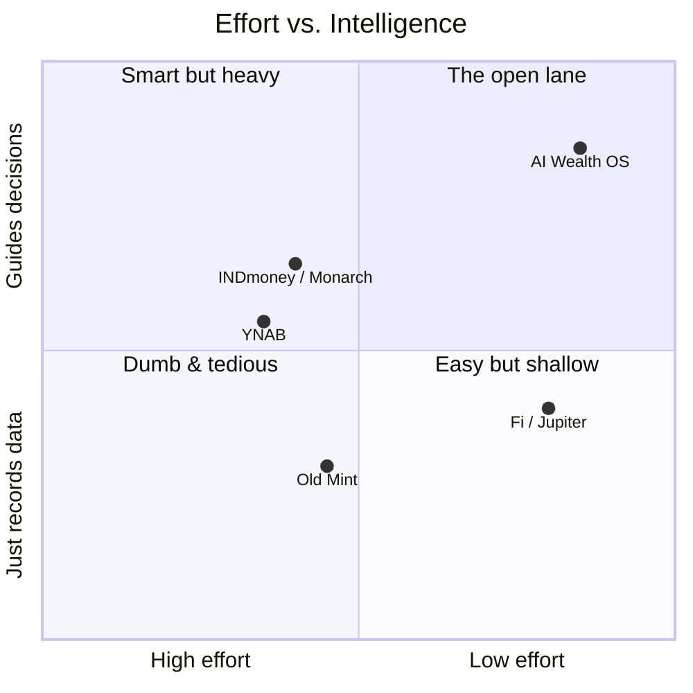

# Chapter 2 — Competitor Analysis & Positioning

> Status: **Draft for review** · Depends on: Chapter 1 (Vision & Users)

> **Honesty note:** The market facts below are from general knowledge, framed for
> *positioning*, not as live market research. If you later want current, citable
> numbers (pricing, funding, feature sets) for a pitch, we can do a dedicated
> web-research pass. For architecture, what matters is *where we sit differently* —
> that's stable regardless of a competitor's latest release.

---

## 2.1 Why a portfolio project needs competitor analysis

A recruiter's silent question is *"does this person understand the market, or did
they just build a CRUD app?"* Competitor analysis is how you prove **product
judgment** — you show you know the landscape and made a *deliberate* choice about
where to stand. That's a senior signal; the code is table stakes.

> **Mentor lens:** Positioning is an *engineering constraint*, not just marketing.
> Every "we sit differently here" decision below becomes a concrete architecture
> requirement in later chapters (e.g. "region-agnostic" → the data model must not
> assume one currency or one bank format). Watch how strategy compiles into schema.

---

## 2.2 The competitive landscape

We group competitors into three archetypes. Our product borrows the *best trait* of
each and rejects their core constraint.

### A. Trackers & budgeting apps
*(YNAB, the late Mint, Walnut, Goodbudget)*

| | |
|---|---|
| **Strength** | Deep budgeting discipline; loyal users |
| **Weakness** | High manual effort or clunky UX; "record the past," little forward guidance |
| **Their constraint** | The user does the *thinking*; the app is a ledger |
| **What we take** | Budgeting as a first-class concept |
| **What we reject** | Effortful entry; passive dashboards |

### B. Neobanks & money apps
*(Fi, Jupiter, Cred, Chime-style apps)*

| | |
|---|---|
| **Strength** | Beautiful UX, auto transaction feeds, engagement |
| **Weakness** | Locked to *their* bank/card; insights are shallow and often nudge you toward *their* products |
| **Their constraint** | You must bank with them; monetization ≠ neutral advice |
| **What we take** | Premium, delightful UX |
| **What we reject** | Bank lock-in; conflicted, product-pushing "advice" |

### C. Wealth & aggregation platforms
*(INDmoney, ET Money, Monarch Money, Copilot, Rocket Money)*

| | |
|---|---|
| **Strength** | Aggregate many accounts; portfolio + net-worth tracking |
| **Weakness** | Setup friction, region-locked integrations, paid tiers, complexity aimed at the financially-savvy |
| **Their constraint** | Depend on paid data aggregators (Plaid / Account Aggregator) → cost + compliance + region lock |
| **What we take** | The "one financial home base" ambition |
| **What we reject** | Integration dependency; complexity that overwhelms the beginner |

---

## 2.3 Feature comparison matrix

Illustrative, positioning-oriented. ✅ strong · 🟡 partial/paid · ❌ absent/weak.

| Capability | Trackers (YNAB) | Neobanks (Fi/Jupiter) | Aggregators (INDmoney/Monarch) | **AI Wealth OS (v1 → roadmap)** |
|---|:--:|:--:|:--:|:--:|
| Delightful UX | 🟡 | ✅ | 🟡 | ✅ |
| Effortless entry (natural language) | ❌ | ❌ | ❌ | ✅ **(wedge)** |
| Auto bank sync | 🟡 | ✅ | ✅ | ❌ *(deliberate — CSV/manual)* |
| Region-agnostic / multi-currency | 🟡 | ❌ | ❌ | ✅ |
| Interpreted "how am I doing?" | 🟡 | 🟡 | 🟡 | ✅ |
| Conversational AI over *your* data | ❌ | 🟡 | 🟡 | ✅ *(Phase 2)* |
| Neutral (non-product-pushing) advice | ✅ | ❌ | 🟡 | ✅ |
| Goals & forecasting | 🟡 | 🟡 | ✅ | ✅ *(Phase 3)* |
| Free to run / use | 🟡 | ✅ | 🟡 | ✅ |

**Read of the matrix:** the one column nobody owns is **"effortless natural-language
entry + interpreted, neutral guidance, without bank lock-in."** That intersection is
our lane.

---

## 2.4 Positioning map

Two axes that matter to our persona (Aarav): **effort to use** (low = better) and
**intelligence / guidance** (high = better).

We deliberately aim for the **top-right (low-effort + high-guidance)** corner — the
one no incumbent fully occupies, because reaching it *without* bank integrations
requires exactly our bet: **AI as the interface**, not integrations as the moat.

> **CTO note — is this bet defensible?** For a real company, "no bank sync" would be
> a serious weakness. For *our* context (portfolio, region-agnostic, ~$0 cost) it's a
> *strength*: it removes our biggest cost/compliance/regional risk and forces the AI
> wedge to carry the experience — which is exactly the skill we want to showcase.
> We're not pretending to beat INDmoney; we're demonstrating a sharp, well-reasoned
> product cut.

---

## 2.5 Our positioning statement

> **AI Wealth OS is the AI-first financial workspace for people who want to
> understand their money without the effort of spreadsheets or the lock-in of a
> bank app. You bring your data — by sentence, or by CSV — and it does the
> thinking.**

Three pillars we will defend in every later chapter:

1. **AI as the interface** — language in, structure and guidance out. (→ Ch 9 AI Architecture)
2. **Neutral & region-agnostic** — no bank lock-in, no product-pushing, any currency. (→ Ch 5 Data model, Ch 6 System)
3. **Beginner-first clarity** — an overwhelmed earner feels in control on day one. (→ Ch 11 Design System)

---

## 2.6 Threats & honest weaknesses

Senior product thinking means naming where we're *weak*, not just where we win.

| Threat / weakness | Reality | Our stance |
|---|---|---|
| **Incumbents add better AI** | Fi/INDmoney could ship NL features | We're not competing for market share — we're demonstrating we can *build* it. Not a project risk. |
| **No auto-sync feels dated** | Some users expect it | Reframed as neutrality + zero-setup + privacy; CSV import softens it |
| **AI accuracy on messy input** | "coffee 250 yest" can misparse | Confirm-before-save step (Ch 9) turns errors into a UX detail, not data corruption |
| **"Yet another finance app"** | Crowded category | The NL wedge + docs quality are the differentiators; lead with them |

---

## 2.7 End-of-chapter checkpoint

### ✅ Decisions locked
- Three competitor archetypes identified: **trackers, neobanks, aggregators**.
- Our lane: **low-effort + high-guidance**, the open top-right quadrant.
- Positioning pillars: **AI-as-interface · neutral & region-agnostic · beginner-first clarity.**
- "No bank sync" is officially reframed from weakness → deliberate strategic cut.

### ❓ Open questions (for you)
1. **Depth of competitor section in the public README:** full matrix + quadrant (shows product depth) or a trimmed 3-line version (keeps README focused on the build)? *(Recommend: full version in `/docs`, 3-line summary in the top-level README.)*
2. **Do you want a live web-research pass** for current pricing/feature facts before this becomes portfolio-facing? *(Recommend: later, once the product is built — not now.)*

### ⚠️ Risks
- **R1 — Overclaiming:** if the README implies we *compete with* INDmoney, a sharp reviewer will poke holes (no sync, no scale). Mitigation: frame as a *demonstration of capability*, never a market claim.
- **R2 — Stale facts:** competitor features change; hard numbers date quickly. Mitigation: keep the doc about *positioning* (durable), defer specific stats to a later research pass.

### 💡 CTO recommendations
- Reuse the **positioning pillars (2.5)** as a literal checklist in later chapters — every architecture decision should serve at least one pillar; if it serves none, question it.
- Keep the quadrant chart in the repo (it renders on GitHub free via Mermaid) — a visual positioning map reads as "this person thinks in systems."

---

**Next chapter on your approval → Chapter 3: Feature Inventory, MVP Wedge & Phase
Roadmap** — where we turn all 18 AI features into a prioritized, buildable
sequence and precisely draw the v1 line.
