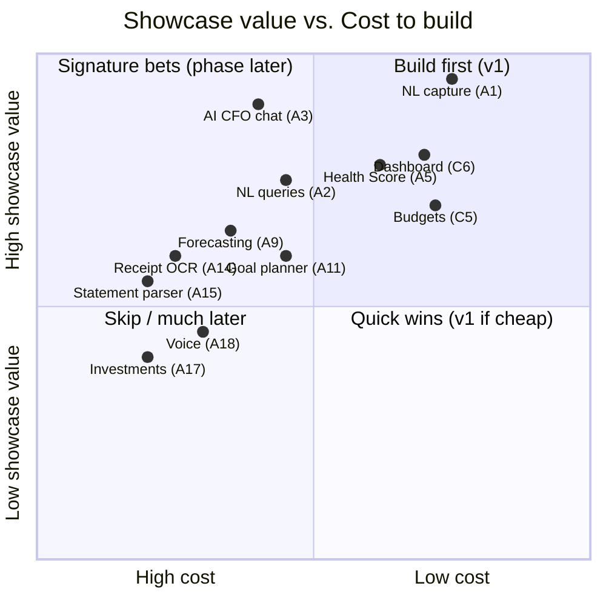

# Chapter 3 — Feature Inventory, MVP Wedge & Phase Roadmap

> Status: **Draft for review** · Depends on: Ch 1 (Users), Ch 2 (Positioning)

This is the chapter that decides what gets built. Everything before was *why*; this
is *what*, in *what order*, and — most importantly — *what we deliberately don't
build yet*.

> **Mentor lens — the single most valuable senior skill here is saying "no."**
> Junior engineers add features; senior engineers *sequence* them and defend a
> small v1. A reviewer reading this chapter should think "this person can scope."

---

## 3.1 Full feature inventory

Two domains: **Core (money mechanics)** and **Intelligence (the 18 AI features)**.
Each feature gets an ID so later chapters (data model, API, roadmap) can reference
it precisely.

### Core domain

| ID | Feature | Notes |
|----|---------|-------|
| C1 | Authentication (sign up / in / out) | Foundation for per-user data |
| C2 | Accounts (cash, bank, card, wallet) | Containers for balances |
| C3 | Transactions (income / expense / transfer) | The atomic record |
| C4 | Categories (system + custom) | Classification |
| C5 | Budgets (per category, per period) | Limits + progress |
| C6 | Dashboard (net worth, cash flow, budgets) | The "how am I doing?" view |
| C7 | CSV / statement import | Bulk data-in without bank sync |
| C8 | Seeded demo data | Instant "full app" for recruiters |
| C9 | Multi-currency support | Charter constraint |
| C10 | Recurring transactions | Subscriptions, salary |

### Intelligence domain (the 18)

| ID | Feature | What it does |
|----|---------|--------------|
| A1 | **Natural-language transaction capture** | Sentence → structured transaction *(flagship wedge)* |
| A2 | Natural-language queries | "How much on food last month?" → answer |
| A3 | AI CFO (chat over your data) | Conversational financial Q&A + guidance |
| A4 | AI Financial Coach | Proactive habit nudges |
| A5 | Financial Health Score | Single 0–100 score + drivers |
| A6 | AI Budget Planner | Suggests budgets from spend history |
| A7 | AI Recommendations | "Cut X", "you can save Y" |
| A8 | Monthly AI report generation | Narrated summary of the month |
| A9 | Cash-flow forecasting | Projects future balance |
| A10 | Expense prediction | Predicts upcoming/recurring spend |
| A11 | AI Goal Planner | Plans savings goals + tracks |
| A12 | Smart notifications | "Budget 90% used" etc. |
| A13 | Automation rules | "If merchant = X → category Y" |
| A14 | Receipt OCR | Photo → transaction |
| A15 | Bank-statement parser (AI) | PDF statement → transactions |
| A16 | Document understanding | Understand uploaded financial docs |
| A17 | Investment insights | Portfolio commentary |
| A18 | Voice commands | Speak instead of type |

---

## 3.2 Prioritization method

We score each feature on two axes tuned for a **portfolio showcase**, not revenue:

- **Showcase value** — demo "wow" + how strongly it proves senior/AI skill.
- **Cost of build** — engineering time **+ runtime $ + risk/compliance**.

> **Mentor lens — why this framework, not RICE?** RICE (Reach·Impact·Confidence /
> Effort) assumes real users and revenue. We have neither; our "reach" is a
> recruiter's 5-minute click-through. So we replace Reach/Impact with a single
> honest metric — *does it make the demo impressive and prove skill?* — and keep
> Effort. Choosing the *right* prioritization model for the context is itself the
> senior move.

### Value vs. Cost placement

Top-right = high value, low cost = **v1**. Top-left = high value, high cost =
**signature Phase-2/3 bets**. Bottom = later or never.

---

## 3.3 The MVP line (v1) — drawn precisely

**v1 = the minimum that (a) works as a real finance app and (b) delivers the "wow."**

### ✅ IN v1

| ID | Feature | Why it's in |
|----|---------|-------------|
| C1 | Auth | Non-negotiable foundation |
| C2 | Accounts | Can't track money without containers |
| C3 | Transactions | The core object |
| C4 | Categories | Needed for any insight |
| C5 | Budgets | The "how am I doing?" backbone |
| C6 | Dashboard | The interpreted view — our differentiator |
| C7 | CSV import | Friction-killer for real data |
| C8 | Seeded demo data | The recruiter's first impression |
| C9 | Multi-currency | Cheap to design in now, painful to retrofit |
| **A1** | **NL transaction capture** | **The flagship wedge — the whole reason this looks AI-first** |

### ❌ OUT of v1 (and *why* — this list is the senior signal)

| Deferred | Why not v1 |
|----------|-----------|
| A3 AI CFO chat | High value but needs a solid data layer + retrieval first; do it *right* in Phase 2 |
| A5 Health Score | Depends on enough data + defined formula; Phase 2 |
| A2 NL queries | Overlaps A3; ship together in Phase 2 |
| A14/A15/A16 OCR & parsing | Vision/PDF models = more cost + accuracy risk; Phase 4 |
| A9/A10 forecasting/prediction | Needs historical data density to be meaningful |
| A17 Investments, A18 Voice | Different data model / input mode; late phases |
| C10 Recurring txns | Nice, not essential to the demo; early Phase 2 |

> **CTO note — the temptation to include AI CFO chat in v1 is strong** (it's the
> flashiest feature). We resist it on purpose: a chat that answers over *thin,
> half-built* data feels broken and *hurts* the demo. Sequencing it after the data
> layer is stable is the difference between "impressive" and "buggy." That
> restraint is the point.

---

## 3.4 MVP "definition of done"

v1 is shippable when **all** of these are true (this is our acceptance contract):

1. A new user can sign up, and their data is isolated from every other user.
2. Demo data loads so the app looks *full* on first open (< 5s to a populated dashboard).
3. A user can **type "coffee 250 yesterday" and get a correct, categorized,
   confirm-before-save transaction** — the wedge works end-to-end.
4. Transactions can also be added via a normal form and via CSV import.
5. The dashboard answers "how am I doing?": net position, spend by category, budget progress.
6. Budgets can be set and show live progress.
7. It's deployed on a public URL, on free tiers, at ~$0/month.
8. `demo mode` makes the AI feature explorable at $0 (cached responses).

> **Mentor lens:** A written "definition of done" is what stops scope creep in
> practice. When you're tempted to add a feature mid-build, you ask: *"is it on the
> DoD list? No? → backlog."* This is how senior engineers ship.

---

## 3.5 Flagship feature — one-paragraph spec (full design in Ch 9)

**A1 — Natural-language transaction capture.**
*Input:* a free-text sentence (e.g. `"lunch 320 yesterday with card"`).
*Processing:* an LLM extracts `{amount, currency, category, date, account, note, type}`
against the user's existing categories/accounts.
*Output:* a **pre-filled transaction draft shown for confirmation** — never saved
silently.
*Guardrails:* confirm-before-save (accuracy safety net), strict token budget, and a
deterministic fallback to the manual form if the model is unavailable.
*Cost:* ~200–500 tokens/call ≈ fraction of a cent; **demo mode** serves cached
results at $0.

> **Debugger lens (preview of Ch 9):** the top failure modes are — misparsed amount,
> wrong/hallucinated category, ambiguous date ("last Friday"), and no-network. The
> confirm step neutralizes the first three; the deterministic fallback neutralizes
> the fourth. We design the feature so *the model being wrong is a normal, handled
> case*, not a crash.

---

## 3.6 Phase roadmap

| Phase | Theme | Features | Exit criterion |
|-------|-------|----------|----------------|
| **1 — MVP** | *Effortless tracking + the wedge* | C1–C9, A1 | DoD (3.4) met, deployed |
| **2 — Understanding** | *It talks back* | A3 AI CFO chat, A2 NL queries, A5 Health Score, A8 monthly report, C10 recurring | Ask a question, get a grounded answer over your data |
| **3 — Planning** | *It looks forward* | A11 goals, A9 forecast, A10 prediction, A6 budget planner, A7 recs, A12 notifications, A13 automation | Set a goal, see a credible plan + on-track signal |
| **4 — Documents & reach** | *It reads & listens* | A14 OCR, A15 statement parser, A16 doc understanding, A17 investments, A18 voice | Photo/PDF/voice → transactions |

> **CTO note — dependency order, not just value order.** Notice Phase 2 comes before
> Phase 3 because *forecasting needs a stable data + insight layer to forecast
> from*. We sequence by **what unblocks what**, not purely by flashiness. That
> dependency-awareness is what makes a roadmap *engineering-credible*.

---

## 3.7 End-of-chapter checkpoint

### ✅ Decisions locked
- Feature inventory formalized with **stable IDs (C1–C10, A1–A18)** for cross-referencing.
- Prioritization model: **Showcase-value × Cost** (context-fit replacement for RICE).
- **v1 = C1–C9 + A1.** Everything else explicitly deferred *with reasons*.
- **MVP Definition of Done** written as an 8-point acceptance contract.
- 4-phase roadmap sequenced by **dependency + value**.

### ❓ Open questions (for you)
1. **CSV import in v1** — keep it in (real-data friction-killer, moderate effort) or push to early Phase 2 to make v1 even leaner? *(Recommend: keep — it's what lets you load *your own* real data into the demo.)*
2. **Health Score in v1?** It's high-value and recruiters love a single number. Pull it into v1 as a *simple rules-based* score (no AI), upgrade to AI later? *(Recommend: tempting, but keep v1 to one AI hero (A1); add rules-based score in early Phase 2.)*
3. **Recurring transactions (C10)** — Phase 2 as written, or nudge into v1 since salary/subscriptions make demo data realistic? *(Recommend: Phase 2; seed data can fake recurrence without the feature.)*

### ⚠️ Risks
- **R1 — Scope creep via "just one more":** every deferred feature will feel cheap to pull forward. Mitigation: the DoD list is the gate.
- **R2 — Wedge underperforms:** if A1's parsing feels unreliable, the whole "AI-first" thesis wobbles. Mitigation: confirm-step + fallback + a curated demo-mode script that always shines.
- **R3 — Thin v1 looks like a tutorial:** if only C1–C6 shipped it'd look generic. Mitigation: A1 + seeded data + polished dashboard are specifically what lift it above CRUD.

### 💡 CTO recommendations
- Freeze the **v1 IN-list** now; treat 3.3's OUT table as the backlog of record.
- Reference features by **ID** in every later chapter (Ch 5 will map each ID → tables; Ch 7 → endpoints). This traceability is a senior-team habit.
- Build **A1 last within Phase 1**, on top of finished C1–C9 — core-first, AI-last — so the AI has a stable data model to write into.

---

**Next chapter on your approval → Chapter 4: Information Architecture & Navigation
Map** — the screens, the nav model, and how a user moves from "logged in" to "logged
a coffee in one sentence."
