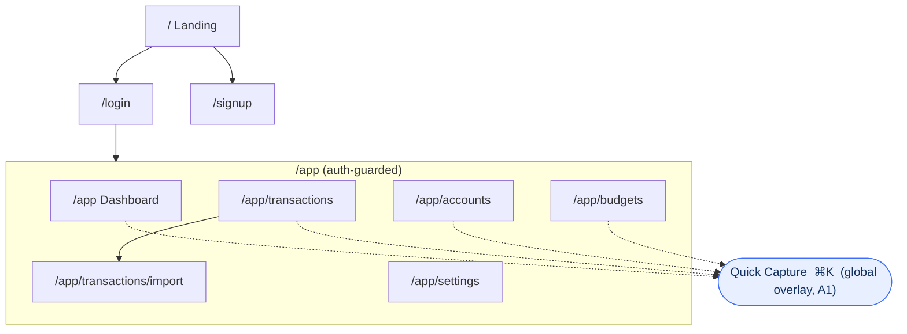
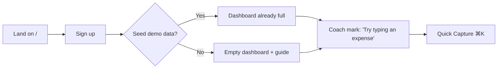
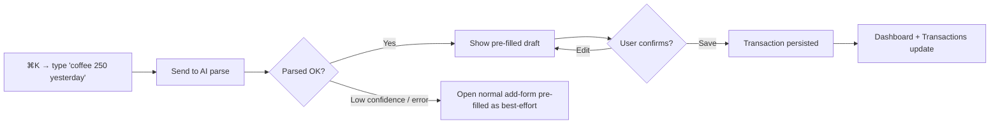

# Chapter 4 — Information Architecture & Navigation Map

> Status: **Draft for review** · Depends on: Ch 3 (v1 feature set: C1–C9 + A1)

Information Architecture (IA) is the *skeleton* of the product: what screens exist,
how they're grouped, how a user moves between them, and what the URLs are. Get it
right and every later layer (frontend routes, API endpoints, auth boundaries) falls
into place. Get it wrong and you refactor navigation forever.

> **Mentor lens:** IA is where UX and engineering meet. Each screen here will become
> a **route** (Ch 8), pull from **endpoints** (Ch 7), and sit inside an **auth
> boundary** (Ch 10). We're not decorating — we're defining the app's structural
> contract. Notice how every screen traces back to a feature ID from Ch 3.

---

## 4.1 Two zones: Public vs. App

The product splits into two hard zones with different layouts and auth rules.

| Zone | Purpose | Auth | Layout shell |
|------|---------|------|--------------|
| **Public** | Convince + let in | None | Marketing/centered |
| **App** | Do the work | Required | Sidebar + top bar |

> **CTO note — why a public zone at all for a portfolio?** A landing page is cheap
> and it's the *first thing a recruiter sees*. It frames the wedge ("type a
> sentence → a transaction") before they even log in. Skipping it would waste our
> best 5 seconds. But it stays minimal — one page, not a site.

---

## 4.2 Screen inventory (v1)

Every screen maps to feature IDs (Ch 3) so nothing is orphaned and nothing is missing.

### Public zone

| Screen | Route | Feature IDs | Purpose |
|--------|-------|-------------|---------|
| Landing | `/` | — | Pitch + demo CTA |
| Sign up | `/signup` | C1 | Create account |
| Log in | `/login` | C1 | Authenticate |

### App zone (all under `/app`, auth-guarded)

| Screen | Route | Feature IDs | Purpose |
|--------|-------|-------------|---------|
| Dashboard | `/app` | C6, C9 | "How am I doing?" — net position, cash flow, budgets |
| Transactions | `/app/transactions` | C3, C4 | List/search/filter; add & edit |
| Import | `/app/transactions/import` | C7 | CSV upload → preview → confirm |
| Accounts | `/app/accounts` | C2, C9 | Manage accounts + balances |
| Budgets | `/app/budgets` | C5 | Set budgets, view progress |
| Settings | `/app/settings` | C4, C9, C1 | Categories, base currency, demo-mode toggle, profile |

### Global (not a screen — an omnipresent action)

| Element | Trigger | Feature IDs | Purpose |
|---------|---------|-------------|---------|
| **Quick Capture** | `＋` button + `⌘K` / `Ctrl-K` | **A1** | The NL capture — available from *every* app screen |

> **Design decision — Quick Capture is global, not a page.** The flagship interaction
> must never be more than one keystroke away. Burying A1 inside a page would bury our
> differentiator. Making it a command-bar overlay (Linear/Notion style) signals
> "premium product" *and* keeps the wedge front-and-center. This is the single most
> important IA decision in the chapter.

---

## 4.3 Navigation model

**Primary nav = left sidebar** (5 items): Dashboard · Transactions · Accounts ·
Budgets · Settings. **Global top bar** holds: base-currency indicator, the `＋ Quick
Capture` button, and the account menu.

> **Mentor lens — sidebar vs. top-tabs vs. bottom-bar (a real trade-off):**
> - *Bottom bar* → mobile-native but caps you at ~5 items and feels like a consumer app.
> - *Top tabs* → fine for few sections, cramped as the app grows.
> - *Left sidebar* → scales to many sections, reads as a "workspace/OS" (fits our
>   "Wealth **OS**" positioning), and is the Linear/Notion/Stripe idiom we're
>   benchmarking against.
>
> We choose **sidebar** because the product is explicitly an *OS*, and later phases
> add sections (Goals, Reports, Documents) that would overflow tabs/bottom-bar. We're
> optimizing IA for the *roadmap*, not just v1 — that's forward-compatible design.
> (On mobile the sidebar collapses to a drawer + a bottom Quick-Capture button.)

---

## 4.4 Sitemap

---

## 4.5 Key user flows

### Flow 1 — First run (the make-or-break 60 seconds)

The default is **seed = yes**: a recruiter must hit a *populated* dashboard, not an
empty shell. Empty-start exists for the honest "I want to use my own data" user.

### Flow 2 — The wedge (A1), end to end

> **Debugger lens:** the `C -- error --> E` branch is not an afterthought — it's the
> reason the feature can *never hard-fail*. If the AI is down or the parse is
> garbage, the user still lands in a working manual form. We design the *unhappy
> path* as a first-class flow. Junior code assumes the API succeeds; senior code
> routes the failure somewhere useful.

### Flow 3 — CSV import (C7)

`Upload file → map columns → preview parsed rows → resolve duplicates → confirm →
bulk insert → land on Transactions filtered to the import.`

### Flow 4 — Set a budget (C5)

`Budgets → pick category + period + limit → save → progress bar reflects existing
spend immediately.`

---

## 4.6 Route → auth → data traceability (the contract)

This table is the seam between IA and the engineering chapters. Each row is a promise
later chapters must keep.

| Route | Auth | Primary data (preview of Ch 5) | Primary endpoints (preview of Ch 7) |
|-------|------|-------------------------------|-------------------------------------|
| `/`, `/login`, `/signup` | Public | `users` | `POST /auth/*` |
| `/app` | User | `accounts`, `transactions`, `budgets` | `GET /dashboard/summary` |
| `/app/transactions` | User | `transactions`, `categories` | `GET/POST/PATCH/DELETE /transactions` |
| `/app/transactions/import` | User | `transactions` | `POST /transactions/import` |
| `/app/accounts` | User | `accounts` | `GET/POST/PATCH /accounts` |
| `/app/budgets` | User | `budgets`, `categories` | `GET/POST/PATCH /budgets` |
| `/app/settings` | User | `categories`, `users` | `GET/PATCH /me`, `/categories` |
| Quick Capture (A1) | User | `transactions`, `categories`, `accounts` | `POST /ai/parse-transaction` |

> **Consistency check:** every v1 feature ID (C1–C9, A1) appears in this table at
> least once. If a later chapter introduces a screen with no ID, or an ID with no
> home here, that's drift — flag it.

---

## 4.7 Empty, loading & error states (designed, not accidental)

| State | Where | Design intent |
|-------|-------|---------------|
| Empty | Transactions/Budgets with no data | Friendly prompt → Quick Capture or "load demo data" |
| Loading | Dashboard first paint | Skeletons, not spinners (feels faster, premium) |
| Error | AI parse fails | Silent fallback to manual form (never a red toast dead-end) |
| Offline | Any AI action | Disable AI affordance, keep manual paths working |

> **Mentor lens:** listing states *now*, in IA, is what prevents the classic
> junior bug — a beautiful happy path and a blank white screen for everything else.
> Every screen owes the user four states, not one.

---

## 4.8 End-of-chapter checkpoint

### ✅ Decisions locked
- Two zones: **Public** (`/`, `/login`, `/signup`) and auth-guarded **App** (`/app/*`).
- 6 app screens + 3 public screens, each mapped to feature IDs.
- **Quick Capture (A1) is a global `⌘K` overlay**, not a page — the headline IA call.
- **Left sidebar** primary nav, chosen for OS-positioning and roadmap headroom.
- 4 core user flows specified, each with its **failure branch** designed in.
- A **route → auth → data → endpoint** traceability table as the contract for Ch 5/7/10.

### ❓ Open questions (for you)
1. **Landing page scope** — one-screen pitch (fast) or a slightly richer 2–3 section page (more portfolio polish)? *(Recommend: one strong screen for v1; expand later.)*
2. **Demo-mode visibility** — expose the "demo mode" toggle in Settings (transparent, recruiter-friendly) or keep it silent/automatic? *(Recommend: visible toggle — it reads as intentional cost-engineering, a plus.)*
3. **Mobile depth in v1** — fully responsive (more work) or "looks good on laptop, usable on mobile" (faster)? *(Recommend: responsive-but-laptop-first; recruiters review on laptops.)*

### ⚠️ Risks
- **R1 — Quick Capture discoverability:** a `⌘K` overlay is elegant but invisible if the user never learns it. Mitigation: a visible `＋` button + a first-run coach mark.
- **R2 — Route sprawl in later phases:** Goals/Reports/Documents will want new sections. Mitigation: the sidebar model already leaves room; keep `/app/*` flat and predictable.
- **R3 — Import UX underestimated:** column-mapping + dedup is deceptively fiddly. Mitigation: scope v1 import to a documented CSV shape; generalize later.

### 💡 CTO recommendations
- Treat the **4.6 traceability table** as a living contract — update it whenever a screen or endpoint changes; it's your cheapest defense against architectural drift.
- Keep app routes **flat and RESTful-looking** (`/app/transactions/import`, not `/app/import-csv-tool`) — predictable URLs are a quiet senior signal.
- Design the **empty state as carefully as the full state** — for a demo it's the *second* thing a recruiter might see (if they skip seed data).

---

**Next chapter on your approval → Chapter 5: Domain Models & Database Design** — the
heart of the system: entities, relationships, the ERD, and the schema that every one
of these screens reads from and writes to.
