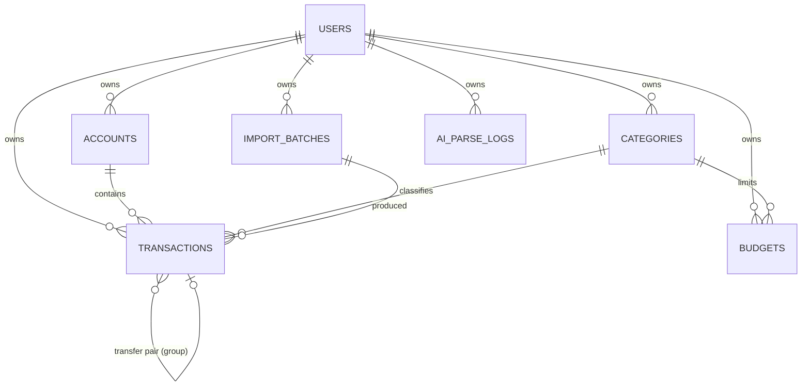

# Chapter 5 — Domain Models & Database Design

> Status: **Draft for review** · Depends on: Ch 3 (features), Ch 4 (route→data table)

The database is the part of the system that is **hardest to change later** and
**most expensive to get wrong**. Screens get redesigned in an afternoon; a bad money
column or a missing `user_id` haunts you for the life of the product. So this chapter
is deliberately the most rigorous.

> **Mentor lens — read this chapter as the one where getting it wrong is
> unforgivable.** UI bugs are visible and cheap. Data bugs are silent and
> compounding: a rounding error or a leaked row corrupts *trust*, and finance apps
> are trust machines. Senior engineers spend disproportionate care exactly here.

---

## 5.1 Domain glossary (the language of the system)

Before tables, we agree on nouns. Every layer (DB, API, UI, AI prompts) must use
these exact words — consistent vocabulary is how a codebase stays legible.

| Term | Meaning |
|------|---------|
| **User** | A person with an account and isolated data |
| **Account** | A container of money (cash, bank, card, wallet) with one currency |
| **Transaction** | A single movement of money: income, expense, or transfer |
| **Category** | A label for classifying transactions (Food, Rent…) |
| **Budget** | A spending limit for a category over a period |
| **Import batch** | A group of transactions created from one CSV upload |
| **AI parse log** | A record of one natural-language capture attempt (A1) |

---

## 5.2 Entity-Relationship Diagram

> **Consistency check:** every box maps to a Ch 3 feature ID — USERS→C1, ACCOUNTS→C2,
> TRANSACTIONS→C3, CATEGORIES→C4, BUDGETS→C5, IMPORT_BATCHES→C7, AI_PARSE_LOGS→A1.
> Multi-currency (C9) is a set of *columns*, not a table (see §5.5). No orphan
> entities, no missing features.

---

## 5.3 Four foundational decisions (these shape every table)

### D1 — Money is stored as **integer minor units**, never a float

`amount_minor BIGINT` (e.g. ₹250.00 → `25000` paise) + a separate `currency CHAR(3)`.

> **Why (the classic senior call):** floating-point can't represent `0.1` exactly.
> `0.1 + 0.2 !== 0.3` in every IEEE-754 language, including JS. In a finance app that
> silently drifts and money "disappears." Storing the smallest unit as an integer
> makes all arithmetic exact. We format to `250.00` only at the display edge.
> **Trade-off:** every read/write must remember the ×100 scale — we centralize that
> in one `Money` helper (Ch 7/8) so the rule lives in exactly one place.

### D2 — Primary keys are **UUIDs**

`id UUID DEFAULT gen_random_uuid()`.

> **Why:** UUIDs don't leak counts or let someone enumerate `/transactions/1,2,3…`
> (an IDOR-style risk in a finance app). They're also generatable client-side, handy
> for optimistic UI. **Trade-off:** random UUIDs hurt index locality vs. a serial
> int. At our scale it's irrelevant; if it ever mattered we'd switch to UUIDv7
> (time-ordered). Naming the trade-off *and* why it doesn't bite us is the senior
> move — not pretending there isn't one.

### D3 — **Every user-owned row carries `user_id`**, and every query is scoped by it

> **Why:** this is our entire authorization model at the data layer (Ch 10/12). One
> forgotten `WHERE user_id = ?` is a cross-tenant data leak — the worst bug a finance
> app can ship. Putting `user_id` on *every* table (even where it's reachable via a
> join) lets us filter directly and cheaply, and makes the security rule uniform:
> *"scope by user_id, always."*

### D4 — **Soft delete** for financial records

`deleted_at TIMESTAMPTZ NULL` on `transactions` and `accounts`.

> **Why:** users fat-finger deletes; recovering a hard-deleted transaction is
> impossible. Soft delete enables undo and keeps history honest. **Trade-off:** every
> query must add `WHERE deleted_at IS NULL` — we bake that into the repository layer
> (Ch 7) so no route can forget it. (Categories/budgets hard-delete — they're
> reference data, not financial history.)

---

## 5.4 Table specifications (v1)

Conventions for all tables: `id UUID PK`, `created_at TIMESTAMPTZ NOT NULL DEFAULT now()`,
`updated_at TIMESTAMPTZ NOT NULL DEFAULT now()` (touched on write).

### `users` — C1

| Column | Type | Constraints |
|--------|------|-------------|
| id | UUID | PK |
| email | CITEXT | UNIQUE, NOT NULL |
| password_hash | TEXT | NOT NULL *(argon2/bcrypt — Ch 10)* |
| name | TEXT | NOT NULL |
| base_currency | CHAR(3) | NOT NULL, default `'INR'` |
| is_demo | BOOLEAN | NOT NULL default false |

> `CITEXT` = case-insensitive text, so `A@x.com` == `a@x.com` — prevents duplicate
> accounts differing only by case. `base_currency` is the user's reporting currency
> for the dashboard (C9).

### `accounts` — C2, C9

| Column | Type | Constraints |
|--------|------|-------------|
| id | UUID | PK |
| user_id | UUID | FK→users, NOT NULL, **indexed** |
| name | TEXT | NOT NULL |
| type | TEXT | NOT NULL, CHECK in (`cash`,`bank`,`card`,`wallet`) |
| currency | CHAR(3) | NOT NULL |
| opening_balance_minor | BIGINT | NOT NULL default 0 |
| is_archived | BOOLEAN | NOT NULL default false |
| deleted_at | TIMESTAMPTZ | NULL |

> Current balance is **derived** (opening_balance + sum of transactions), not stored.
> *Why:* a stored balance is a denormalization that drifts out of sync with the
> transactions that define it — a classic bug source. Compute it; cache later only if
> a real perf need appears (it won't, at our scale).

### `categories` — C4

| Column | Type | Constraints |
|--------|------|-------------|
| id | UUID | PK |
| user_id | UUID | FK→users, **NULL = system default**, indexed |
| name | TEXT | NOT NULL |
| kind | TEXT | NOT NULL, CHECK in (`income`,`expense`) |
| icon | TEXT | NULL |
| color | TEXT | NULL |
| is_system | BOOLEAN | NOT NULL default false |

> System categories (`user_id IS NULL, is_system=true`) are seeded once and shared;
> users add their own. `kind` keeps income and expense categories from mixing in
> pickers. Unique per user: `(user_id, name, kind)`.

### `transactions` — C3 (the core table)

| Column | Type | Constraints |
|--------|------|-------------|
| id | UUID | PK |
| user_id | UUID | FK→users, NOT NULL, indexed |
| account_id | UUID | FK→accounts, NOT NULL |
| category_id | UUID | FK→categories, NULL (transfers/uncategorized) |
| type | TEXT | NOT NULL, CHECK in (`income`,`expense`,`transfer`) |
| amount_minor | BIGINT | NOT NULL, CHECK > 0 |
| currency | CHAR(3) | NOT NULL *(= account currency)* |
| amount_base_minor | BIGINT | NOT NULL *(value in user.base_currency at capture, §5.5)* |
| occurred_at | TIMESTAMPTZ | NOT NULL *(when it happened, not when logged)* |
| note | TEXT | NULL |
| source | TEXT | NOT NULL, CHECK in (`manual`,`ai`,`import`) default `manual` |
| transfer_group_id | UUID | NULL *(links the two legs of a transfer)* |
| import_batch_id | UUID | FK→import_batches, NULL |
| deleted_at | TIMESTAMPTZ | NULL |

> **`amount_minor` is always positive; direction comes from `type`.** *Why not signed
> amounts?* Signed amounts invite "is a refund a negative expense or a positive
> income?" ambiguity. An explicit `type` + positive magnitude is unambiguous and
> reads clearly in queries (`SUM ... WHERE type='expense'`).
>
> **`source` tags AI-created rows** — great for the demo ("this one came from natural
> language") and for measuring the wedge.

### `budgets` — C5

| Column | Type | Constraints |
|--------|------|-------------|
| id | UUID | PK |
| user_id | UUID | FK→users, NOT NULL, indexed |
| category_id | UUID | FK→categories, NOT NULL |
| period | TEXT | NOT NULL, CHECK in (`monthly`) *(v1 = monthly only)* |
| amount_minor | BIGINT | NOT NULL, CHECK > 0 |
| currency | CHAR(3) | NOT NULL |
| starts_on | DATE | NOT NULL |

> Budget *progress* is computed on read (sum of matching expense transactions in the
> period) — not stored. Unique: `(user_id, category_id, period, starts_on)`.

### `import_batches` — C7

| Column | Type | Constraints |
|--------|------|-------------|
| id | UUID | PK · user_id FK (indexed) · filename TEXT · row_count INT · status TEXT CHECK in (`pending`,`committed`,`reverted`) |

> Grouping imported rows under a batch makes **"undo this import"** a one-line
> operation (soft-delete where `import_batch_id = ?`). Designing for reversibility is
> a maturity signal.

### `ai_parse_logs` — A1

| Column | Type | Constraints |
|--------|------|-------------|
| id | UUID | PK · user_id FK (indexed) · input_text TEXT · parsed_json JSONB · model TEXT · confidence NUMERIC · tokens INT · accepted BOOLEAN · created_at |

> This table earns its keep three ways: (1) **debugging** the wedge ("what did the
> model return for this input?"), (2) **demo-mode cache** — replay a known
> `input_text → parsed_json` at $0, (3) a **metric** — acceptance rate of AI parses.
> Storing the raw input + output of an AI call is a pattern you'll reuse in every AI
> feature.

---

## 5.5 Multi-currency strategy (C9) — the subtle one

Two currencies coexist: an account's **native** currency and the user's **base**
(reporting) currency.

- Each transaction stores `amount_minor` + `currency` (native) **and**
  `amount_base_minor` (converted to `user.base_currency` at capture time).
- Dashboard aggregates in **base** currency by summing `amount_base_minor` — no
  per-request conversion, no live FX dependency.

> **Why snapshot the base amount instead of converting on read?** (a) It removes any
> runtime FX-API dependency (cost + a network failure point — matches our $0/offline
> goals). (b) It's *historically honest*: a ₹ value of a $100 expense should reflect
> the rate *when it happened*, not today's. **Trade-off:** if the user changes their
> base currency later, historical `amount_base_minor` needs a backfill — an
> acceptable, rare, batch operation. For v1 we seed a small static rate table; a live
> rate provider is a Phase-later swap behind the same column.

---

## 5.6 Indexing plan (query-driven, not guessed)

Indexes follow the *actual* read patterns from Ch 4's screens:

| Index | Serves |
|-------|--------|
| `transactions (user_id, occurred_at DESC)` | Transactions list, dashboard time ranges |
| `transactions (user_id, category_id, occurred_at)` | Budget progress, spend-by-category |
| `transactions (account_id)` | Account balance derivation |
| `accounts (user_id)`, `budgets (user_id)`, `categories (user_id)` | Per-user scoping |
| partial `WHERE deleted_at IS NULL` | Skip soft-deleted rows |

> **Mentor lens:** you index for the queries you *actually run*, not "just in case."
> Every index speeds reads but slows writes and costs storage. We derived these from
> the screen inventory — that's why IA came before the schema.

---

## 5.7 ORM & migrations — recommendation

**Recommendation: Prisma** (schema-first, typed client, first-class migrations).

> **Why Prisma over raw SQL or Knex, for *you*:** its declarative `schema.prisma` is
> a readable single source of truth (great for learning + for a reviewer to read),
> the generated types make the whole backend type-safe end-to-end, and
> `prisma migrate` gives versioned, reviewable migrations — exactly the artifact you
> want to practice reading. **Trade-offs / alternatives:**
> - *Drizzle* — SQL-closer, lighter, better if you want to *see* the SQL; steeper
>   for a beginner.
> - *Raw SQL + Knex* — maximum control, maximum footgun; more boilerplate.
>
> Prisma's cost is a little "magic" and a heavier client — negligible here. If your
> learning goal is "get fluent in raw SQL," we'd pick Drizzle instead. **This is a
> genuine fork — flagged as an open question below.**

---

## 5.8 End-of-chapter checkpoint

### ✅ Decisions locked
- 7 tables: `users, accounts, categories, transactions, budgets, import_batches, ai_parse_logs`.
- **Money = integer minor units + currency code** (never float).
- **UUID PKs**, **`user_id` on every owned row**, **soft-delete** for financial records.
- Transfers modeled as a **linked pair via `transfer_group_id`**; direction via `type`, magnitude always positive.
- Balances & budget progress are **derived, not stored**.
- Multi-currency via **`amount_base_minor` snapshot** at capture time.
- Indexes derived from Chapter 4's real screen queries.

### ❓ Open questions (for you)
1. **ORM choice — Prisma vs Drizzle.** Learning goal: fastest type-safe DX (**Prisma**) or get close to raw SQL (**Drizzle**)? *(Recommend: Prisma — best for learning to read migrations + end-to-end types.)*
2. **Transfer modeling — two linked rows vs. one row with `counter_account_id`.** *(Recommend: two linked rows via `transfer_group_id` — each account's history stays complete and balances derive cleanly. Slightly more write logic.)*
3. **Categories: seed set.** Want me to define the default system-category list (Food, Rent, Transport…) now, or in Ch 11 with the design/seed data? *(Recommend: define alongside seed data in Ch 11.)*

### ⚠️ Risks
- **R1 — Forgotten `user_id` / `deleted_at` filter:** the highest-severity bug class. Mitigation: a repository layer (Ch 7) that *always* injects both; never query models raw in route handlers.
- **R2 — Money handled as float anywhere in the stack:** one careless `parseFloat` reintroduces drift. Mitigation: a shared `Money` type at both API and UI edges; lint against raw arithmetic on amounts.
- **R3 — Transfer double-count:** a transfer summed as expense would distort dashboards. Mitigation: all spend/income aggregates must exclude `type='transfer'`; add a test for it (Ch 13).

### 💡 CTO recommendations
- Make the **repository layer** the *only* place that touches the DB, so D3 (user scoping) and D4 (soft delete) are enforced structurally, not by discipline.
- Keep `schema.prisma` (or Drizzle schema) as the **single source of truth**; the ERD in this doc is generated *from* it, never hand-maintained in parallel.
- Write the **"transfers aren't spend" test first** — it's the rule most likely to be silently violated by a future change.

---

**Next chapter on your approval → Chapter 6: System Architecture** — how the Next.js
frontend, the Express API, the database, and the AI provider fit together as running
services, with the request lifecycle and the demo-mode path drawn end to end.
