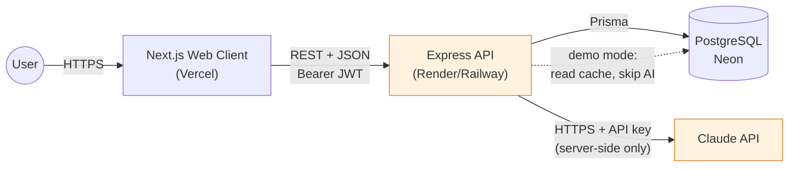
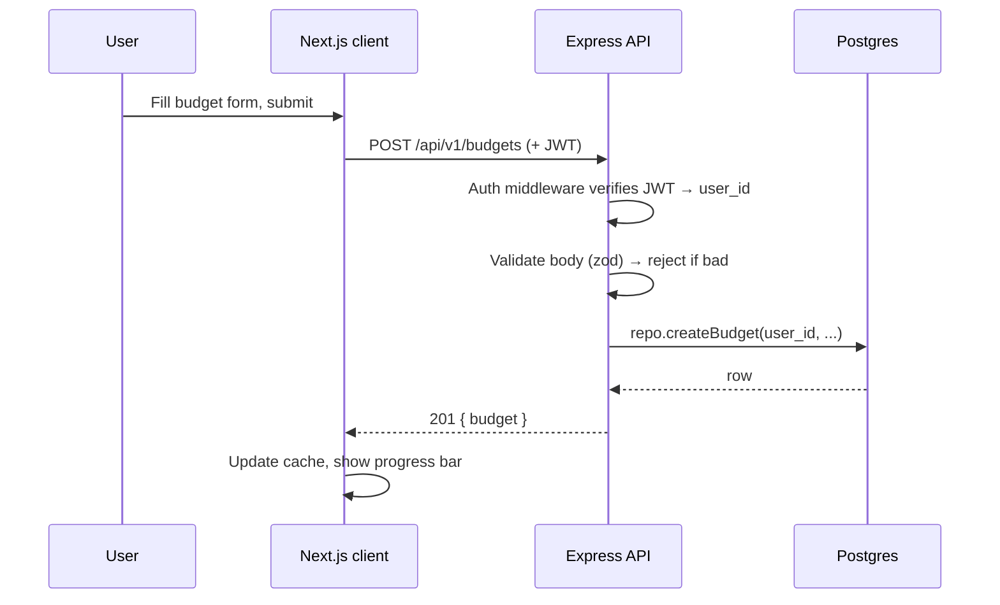
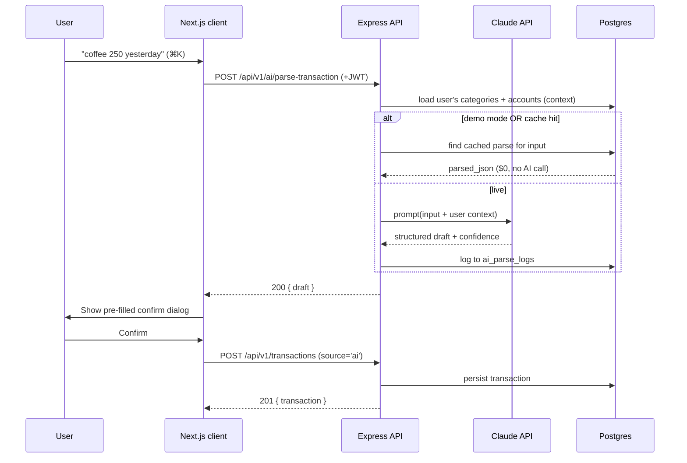

# Chapter 6 — System Architecture

> Status: **Draft for review** · Depends on: Ch 4 (routes), Ch 5 (data)
> Locked upstream: ORM = **Prisma**; transfers via `transfer_group_id`.

Chapters 1–5 defined *what* the product is. From here we design *how the running
system is shaped* — the services, how they talk, and what happens on each request.
This chapter is the "10,000-foot map"; Chapters 7–9 zoom into each box.

> **Mentor lens:** system architecture is about **boundaries and contracts** — where
> you draw lines between parts, and the agreements across those lines. Good
> boundaries let each piece change independently. The most important line here is the
> **API contract** between the Next.js app and the Express server: get that stable
> and both sides evolve freely.

---

## 6.1 The components

Four runtime pieces + one clever cost trick.

| # | Component | Tech | Responsibility |
|---|-----------|------|----------------|
| 1 | **Web client** | Next.js (React) | UI, routing, rendering; holds *no* secrets |
| 2 | **API server** | Node + Express | Business logic, auth, DB access, AI orchestration |
| 3 | **Database** | PostgreSQL (Neon) | Durable state (Ch 5 schema) via Prisma |
| 4 | **AI provider** | Claude API *(model/cost in Ch 9)* | Turns natural language → structured data (A1) |
| ✦ | **Demo-mode cache** | `ai_parse_logs` table | Replays known AI results at **$0** |

---

## 6.2 System diagram

> **Security decision — the AI key lives *only* on the server.** The browser never
> holds the Claude API key. A client-side key would be extractable from network
> tools and billable by anyone — a classic, expensive leak. **Rule: every third-party
> secret is server-side.** The client asks *our* API; our API talks to Claude. (More
> in Ch 12.)

---

## 6.3 Why a separate Express API (not Next.js API routes)

You chose Next + Express; here's the honest trade-off analysis, because a reviewer
*will* ask "why two services?"

| | Next-only (API routes) | **Next + separate Express (chosen)** |
|---|---|---|
| Infra | 1 deploy | 2 deploys (more ops) |
| Separation of concerns | Blurred | **Clean — API is framework-agnostic** |
| Reusability | Tied to Next | **API usable by mobile/CLI later** |
| Skill signal | "Next full-stack" | **"Designs service boundaries"** |
| Cold starts | Serverless | One warm-ish service *(free tier sleeps)* |

> **CTO note — is the extra service worth it *here*?** For pure velocity, Next-only
> wins. We accept the extra ops because (a) it demonstrates the **service-boundary
> thinking** companies hire for, and (b) it keeps business logic in a portable
> Express app rather than fused into the UI framework. That's a *deliberate*
> trade-off — exactly the kind you should be able to defend in an interview. If this
> were a real startup optimizing time-to-market, Next-only would be the right call,
> and saying so is part of the maturity.

---

## 6.4 The API is the contract

The two app services communicate over a **stateless REST/JSON API** authenticated
by a **JWT bearer token**.

- **Stateless** — the server keeps no session in memory; the JWT carries identity.
  *Why:* a stateless server can restart, scale, or sleep (free tier!) without losing
  sessions, and needs no session store. (Auth details in Ch 10.)
- **REST/JSON** — predictable, cacheable, universally understood; the endpoint list
  from Ch 4's traceability table (§4.6) *is* the contract.
- **Versionable** — routes live under `/api/v1/*` so we can evolve without breaking
  clients.

> **Mentor lens:** "the API is the contract" means the frontend and backend can be
> built, tested, and changed *independently* as long as both honor the endpoint
> shapes. This is why we can mock the API to build UI before the backend exists, and
> why a future mobile app needs zero backend changes.

---

## 6.5 Request lifecycle — a normal CRUD write (add a budget)

Note the fixed order every write follows: **authenticate → validate → business logic
→ persist → respond**. That consistent pipeline is defined once in Ch 7 and reused by
every endpoint.

---

## 6.6 Request lifecycle — the wedge (A1), with demo mode

> **Two senior details here.** (1) **Parse and save are separate calls** — the AI only
> ever produces a *draft*; persistence happens on explicit confirm. This makes "the
> AI was wrong" a harmless edit, never bad data (echoes Ch 3/4). (2) **Demo mode is a
> branch at the service layer**, not a fork of the whole app — one `if` decides
> cache-vs-live, so the rest of the flow is identical. Cheap to build, easy to reason
> about.

---

## 6.7 Synchronous now, async-ready later

**v1 is fully synchronous** request/response — no queues, no workers. That's correct
for the MVP: nothing in C1–C9 + A1 needs background processing.

> **Forward-compatibility note:** Phase 2+ features *do* want async — monthly report
> generation, cash-flow forecasting, batch statement parsing. The architecture leaves
> a clean seam: those become **jobs** enqueued by the API and run by a worker
> (e.g. a lightweight queue + a background process). We don't build it now (**YAGNI**),
> but we know *exactly where it slots in* — the API already isolates business logic in
> services (Ch 7), so a service can be called by a route *or* a worker unchanged.
> Designing the seam without building the machinery is the balance senior engineers
> strike.

---

## 6.8 Environments & configuration

| Concern | Approach |
|---------|----------|
| Config | `.env` per service; **secrets never in code/repo** |
| Environments | `local` → `production` (a preview/staging is optional later) |
| Secrets | DB URL, JWT secret, Claude API key — all server-side env vars |
| Client config | Only *public* values (API base URL) exposed to the browser |

> **Debugger/security lens:** the #1 real-world leak is a secret committed to git or
> shipped to the client bundle. Rule: if it's a secret, it's an env var on the API,
> and it never crosses to the Next.js client. We'll add a check for this in Ch 12/13.

---

## 6.9 Non-functional expectations (v1, showcase scale)

| Attribute | Target | How |
|-----------|--------|-----|
| Latency (CRUD) | < 300 ms typical | Indexed queries (Ch 5), small payloads |
| Latency (AI parse) | ~1–2 s | Show skeleton/streaming state; demo-mode is instant |
| Availability | "good enough for demo" | Free tiers sleep; a warm-up ping before demos (Ch 14) |
| Cost | ~$0/month | Free tiers + demo-mode cache |
| Scale | dozens of users | Stateless API scales horizontally *if ever needed* |

> **Honest framing:** we are **not** engineering for millions of users — that would be
> resume fiction. We engineer for *correctness, clarity, and a clean scaling story we
> can articulate*. Knowing the difference between "built to scale" and "designed so it
> *could* scale" is itself senior judgment (expanded in Ch 14).

---

## 6.10 End-of-chapter checkpoint

### ✅ Decisions locked
- Four components: **Next.js client · Express API · Postgres/Neon · Claude API**, plus a **demo-mode cache** in `ai_parse_logs`.
- **All secrets (incl. AI key) are server-side**; the client holds none.
- Services talk via a **stateless, versioned REST/JSON API with JWT** — "the API is the contract."
- Separate Express API chosen deliberately for **service-boundary skill** + portability, trade-off acknowledged.
- **AI parse and transaction save are separate calls**; demo mode is a single service-layer branch.
- **v1 synchronous**; async seam identified for Phase 2+ (no machinery built now).

### ❓ Open questions (for you)
1. **API base path** — `/api/v1/*` on the Express service from day one (my rec, cheap future-proofing) or unversioned `/api/*` for simplicity? *(Recommend: `/api/v1`.)*
2. **Warm-up strategy for free-tier sleep** — a tiny cron ping to keep the API awake during job-hunt season, or just accept a ~30s cold start and warm it manually before a demo? *(Recommend: manual warm-up for v1; add a cron only if it bites.)*
3. **Monorepo vs two repos** — one repo with `/web` + `/api` folders (easier to showcase, one link) or two separate repos? *(Recommend: monorepo — one portfolio link, shared types possible.)*

### ⚠️ Risks
- **R1 — Two-service latency/CORS friction:** cross-origin calls + two deploys add config surface. Mitigation: document CORS + env config once (Ch 7/14); monorepo keeps them in sync.
- **R2 — Free-tier cold starts during a live demo:** a 30s spin-up looks broken to a recruiter. Mitigation: warm-up ping right before demoing; demo-mode keeps AI instant.
- **R3 — Secret leakage to client bundle:** Next.js will expose any `NEXT_PUBLIC_*` var. Mitigation: strict naming rule + a build check (Ch 12).

### 💡 CTO recommendations
- Adopt the **monorepo** with `/web`, `/api`, and a shared `/packages/types` — so the API's response types are *imported* by the client, making "the API is the contract" literally type-checked. Strong senior signal.
- Keep **demo mode as one branch** in the AI service, never a parallel codebase.
- Write the **request pipeline (auth→validate→logic→persist→respond) once** in Ch 7 and never hand-roll it per route.

---

**Next chapter on your approval → Chapter 7: Backend Architecture** — the inside of
the Express box: layered structure (routes → services → repositories), folder
layout, the request pipeline, validation, error handling, and how every Ch 4 endpoint
is organized.
