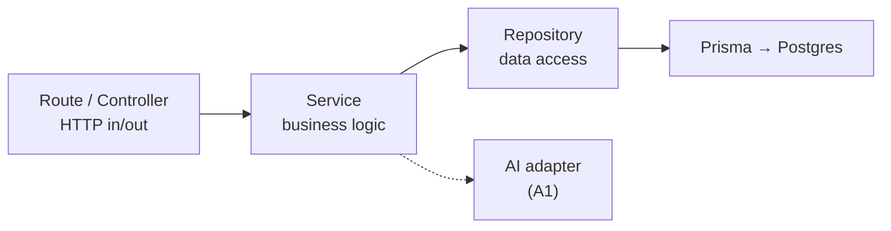
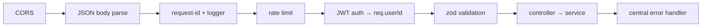

# Chapter 7 — Backend Architecture

> Status: **Draft for review** · Depends on: Ch 5 (schema), Ch 6 (system, contract)
> Locked upstream: Prisma · monorepo · `/api/v1` · JWT · stateless

This chapter opens the "Express API" box from Ch 6 and defines its *internal*
structure: the layers, the folder layout, the request pipeline, validation, error
handling, and the full endpoint contract. This is the chapter you'll hold real pull
requests against.

> **Mentor lens:** the whole game in backend architecture is **separation of
> concerns** — each layer does *one* job and knows as little as possible about the
> others. When layers are clean, you can unit-test business logic without a database,
> swap Prisma for raw SQL without touching routes, and a new engineer can find *any*
> logic by its layer. Watch how each rule below buys us testability or safety.

---

## 7.1 Layered architecture

Every request flows through the same four layers, each with a single responsibility:



| Layer | Owns | Must NOT |
|-------|------|----------|
| **Route/Controller** | Parse HTTP, call one service, shape response | Contain business rules or SQL |
| **Service** | Business logic, orchestration, transactions | Know about `req`/`res` or HTTP |
| **Repository** | All DB access via Prisma; **injects `user_id` + `deleted_at`** | Contain business rules |
| **Adapter** (AI, later FX) | Talk to external providers | Leak provider details upward |

> **Why this matters (the payoff):**
> - Services are **HTTP-agnostic** → testable with plain function calls, and callable
>   from a future background worker (the async seam from Ch 6.7) *unchanged*.
> - Repositories are the **only** place that touches the DB → Ch 5's D3 (user scoping)
>   and D4 (soft delete) are enforced *structurally*, in one place, not by remembering
>   a `WHERE` clause in 40 handlers.
> - **Trade-off:** more files and a little "pass-through" boilerplate for trivial
>   endpoints. Worth it — the boilerplate is cheap; a cross-tenant leak is not.

---

## 7.2 Folder structure (monorepo)

```
ai-wealth-os/
├─ package.json                # workspaces: web, api, packages/*
├─ packages/
│  └─ types/                   # shared TS types — the typed API contract (Ch 6.4)
│     └─ src/{transaction,budget,account,api}.ts
├─ web/                        # Next.js app (Ch 8)
└─ api/
   ├─ prisma/
   │  ├─ schema.prisma         # single source of truth for the schema (Ch 5)
   │  ├─ migrations/           # versioned, reviewable migrations
   │  └─ seed.ts               # demo data + system categories (Ch 11)
   └─ src/
      ├─ index.ts              # app bootstrap, middleware wiring
      ├─ config/               # env loading + validation (fail fast)
      ├─ middleware/           # auth, error handler, request-id, rate-limit
      ├─ modules/              # feature-first: each owns its slice
      │  ├─ auth/              # auth.routes · auth.service · auth.schema
      │  ├─ accounts/          # *.routes · *.service · *.repository · *.schema
      │  ├─ transactions/
      │  ├─ budgets/
      │  ├─ categories/
      │  ├─ dashboard/         # read-model / aggregate queries
      │  └─ ai/                # parse-transaction service + Claude adapter + demo cache
      ├─ lib/                  # money helper, date utils, logger, AppError
      └─ prisma-client.ts      # single Prisma instance (avoid connection storms)
```

> **Design decision — feature-first ("modules"), not type-first.** We group by
> *domain* (`transactions/`) not by *kind* (`controllers/`, `services/`). *Why:*
> everything about transactions lives together, so a change is local and a reviewer
> reads one folder. Type-first foldering scatters one feature across five
> directories — fine for tiny apps, painful as they grow. This is the Nest/modular-
> monolith idiom and it scales straight into our phased roadmap.

---

## 7.3 The request pipeline (middleware chain)

Defined **once**, applied to every route in order:



- **Auth middleware** verifies the JWT once and attaches `req.userId`; every
  downstream layer trusts that single value. (Ch 10 details the token.)
- **Validation middleware** runs a **zod** schema for the route's body/params/query
  *before* the controller. Invalid input never reaches business logic.
- **Central error handler** is the *last* middleware; every thrown error funnels here
  into one consistent response shape (§7.5).

> **Mentor lens:** a single, ordered pipeline means cross-cutting concerns (auth,
> logging, validation, errors) are solved *once*. A junior codebase re-implements
> auth checks and try/catch in every handler; a senior one centralizes them so a
> handler is ~5 lines of pure intent.

---

## 7.4 Validation with zod

Each endpoint declares a schema; the same schema is the **source of the shared type**
(via `z.infer`) that lands in `packages/types` and is imported by the client.

> **Why zod, and why it's a big win:** one declaration gives you (1) runtime
> validation at the boundary, (2) a static TS type, and (3) the client-side contract —
> from a single source. Input validation at the edge is also a **security control**
> (Ch 12): it's your first defense against malformed or malicious payloads. *Never
> trust the client* — even your own.

Illustrative (design artifact, not implementation):

```
CreateTransactionSchema = {
  accountId: uuid,
  type: enum('income','expense','transfer'),
  amountMinor: int().positive(),
  currency: string().length(3),
  occurredAt: isoDate,
  categoryId: uuid().optional(),
  note: string().max(280).optional(),
}
```

---

## 7.5 Error handling — one shape, always

A typed `AppError` hierarchy (`NotFound`, `Unauthorized`, `Validation`, `Conflict`,
`Internal`) → one JSON envelope from the central handler:

```
// success            // error
{ "data": ... }       { "error": { "code": "VALIDATION", "message": "...", "details": [...] } }
```

> **Debugger lens:** consistent errors are a debugging superpower. Every failure has a
> stable `code` the frontend can branch on and the logs can group by. The rule:
> **services throw typed errors; controllers never `try/catch`** — they let the
> central handler translate. Leaking a raw Prisma error to the client (with SQL/stack)
> is both a UX failure and an information-disclosure vuln — the handler sanitizes it.

---

## 7.6 REST API contract (v1 endpoints)

The concrete contract, expanding Ch 4's traceability table. All under `/api/v1`, all
(except auth) require a JWT, all scoped to `req.userId`.

| Method | Path | Feature | Notes |
|--------|------|---------|-------|
| POST | `/auth/signup` | C1 | → user + tokens |
| POST | `/auth/login` | C1 | → tokens |
| POST | `/auth/refresh` | C1 | rotate access token (Ch 10) |
| POST | `/auth/logout` | C1 | invalidate refresh |
| GET | `/me` · PATCH `/me` | C1,C9 | profile, base currency |
| GET/POST | `/accounts` · PATCH/DELETE `/accounts/:id` | C2 | soft-delete |
| GET/POST | `/categories` · PATCH/DELETE `/categories/:id` | C4 | system + custom |
| GET/POST | `/transactions` · PATCH/DELETE `/transactions/:id` | C3 | list = paginated + filters |
| POST | `/transactions/import` | C7 | batch insert under `import_batch` |
| POST | `/transactions/import/:batchId/revert` | C7 | undo an import |
| GET/POST | `/budgets` · PATCH/DELETE `/budgets/:id` | C5 | progress computed |
| GET | `/dashboard/summary` | C6 | aggregates (net, cash flow, budgets) |
| POST | `/ai/parse-transaction` | A1 | NL → draft (demo-mode aware) |

> **Consistency check:** every v1 feature ID (C1–C9, A1) has at least one endpoint,
> and every endpoint traces to an ID. Nouns are plural, IDs in the path, verbs are
> HTTP methods — a uniform REST style a reviewer can predict.

---

## 7.7 Two representative service behaviors

**Transfer (Ch 5 §5.4):** `transactionService.createTransfer()` writes **two linked
rows** (out of source, into destination) sharing a `transfer_group_id`, inside **one
Prisma transaction** so it's all-or-nothing.

> **Why a DB transaction:** a transfer that writes one leg then crashes would create
> money from nothing. Wrapping both writes in a transaction guarantees atomicity —
> the classic reason transactions exist. This is the kind of invariant a senior
> engineer spots instantly.

**Dashboard summary:** `dashboardService.getSummary()` runs a **hand-written
aggregate query** (the "prove I know SQL under Prisma" piece from Ch 5), excluding
`type='transfer'` and `deleted_at IS NOT NULL`, summing `amount_base_minor` by
category and period.

---

## 7.8 Conventions (the style contract)

| Concern | Convention |
|---------|-----------|
| Files | `feature.layer.ts` → `transactions.service.ts` |
| Case | `camelCase` vars/functions, `PascalCase` types, `SCREAMING_SNAKE` enums/const |
| Money | never a raw number — always through `lib/money` |
| DB access | only in repositories; services/routes never import Prisma directly |
| Async | `async/await` only, no raw `.then()` chains |
| Errors | throw typed `AppError`; never `res.status(500).send(err)` |

> **Mentor lens:** conventions aren't bureaucracy — they're what let *you* read code
> you wrote three months ago, and what let a reviewer spot the odd one out. The value
> is in their *uniformity*, not their specific choice.

---

## 7.9 PR-reviewer walkthrough (practice)

Reviewing a hypothetical `GET /transactions` PR, here's the senior checklist you're
building toward:

- ✅ **Good:** controller is thin; service holds logic; repository injects `user_id` + `deleted_at`; zod-validated query params; typed response from `packages/types`.
- 🔶 **Request changes if:** pagination is unbounded (DoS via huge `limit`), an N+1 query loads categories per row, `amount` is formatted in the service (formatting is a UI concern), or the filter lets you pass another user's `accountId` unchecked.
- ❌ **Block if:** Prisma imported in the controller, missing `user_id` scope, or money touched as a float.

> This is exactly the lens from your mentorship instructions — *would I approve this
> PR?* We encode the answer as reusable checks so review becomes muscle memory.

---

## 7.10 End-of-chapter checkpoint

### ✅ Decisions locked
- **Four layers:** route → service → repository → (Prisma / adapter), each single-responsibility.
- **Feature-first module folders** under `api/src/modules/*`.
- **One ordered middleware pipeline**: CORS → parse → log → rate-limit → auth → validate → handler → error.
- **zod** for validation *and* as the source of shared types in `packages/types`.
- **One error envelope**; services throw typed `AppError`, controllers never catch.
- Full **`/api/v1` endpoint contract**, every ID covered.
- **Transfers atomic** via a Prisma transaction; dashboard uses hand-written SQL aggregate.

### ❓ Open questions (for you)
1. **Rate limiting in v1** — include a basic limiter (protects the AI endpoint from a runaway/costly loop) or defer? *(Recommend: include a light limiter on `/ai/*` — it directly guards your $ budget.)*
2. **Pagination style** — cursor-based (scales, slightly more work) or offset/limit (simpler, fine at our scale) for `/transactions`? *(Recommend: offset/limit for v1; note cursor as the upgrade.)*
3. **API docs artifact** — generate an OpenAPI/Swagger spec from the zod schemas (great portfolio flourish) or keep the contract in this markdown for v1? *(Recommend: markdown now, OpenAPI as a Phase-2 polish.)*

### ⚠️ Risks
- **R1 — Boilerplate fatigue → shortcuts:** the layering tempts "just query Prisma in the controller" for a quick endpoint. That reintroduces the leak risk. Mitigation: a lint rule banning Prisma imports outside repositories.
- **R2 — Validation gaps:** an unvalidated field is an injection/logic-bug vector. Mitigation: zod on *every* route; a test asserts each route has a schema.
- **R3 — Unbounded queries:** no default `limit` on lists → slow queries + payloads. Mitigation: enforce a max page size in the repository.

### 💡 CTO recommendations
- Enforce the "**Prisma only in repositories**" rule with an ESLint `no-restricted-imports` — turn a discipline into a guardrail.
- Put the **money helper and the `AppError` hierarchy in `lib/` first** — they're used everywhere; building them early prevents inconsistent ad-hoc handling.
- Keep `packages/types` as the **shared contract**; when an endpoint's shape changes, the type change ripples to the client at compile time — your cheapest integration test.

---

**Next chapter on your approval → Chapter 8: Frontend Architecture** — the inside of
the Next.js box: App Router structure, server vs client components, state/data
fetching, the component hierarchy, and how the shared types make the UI type-safe
against the API.
