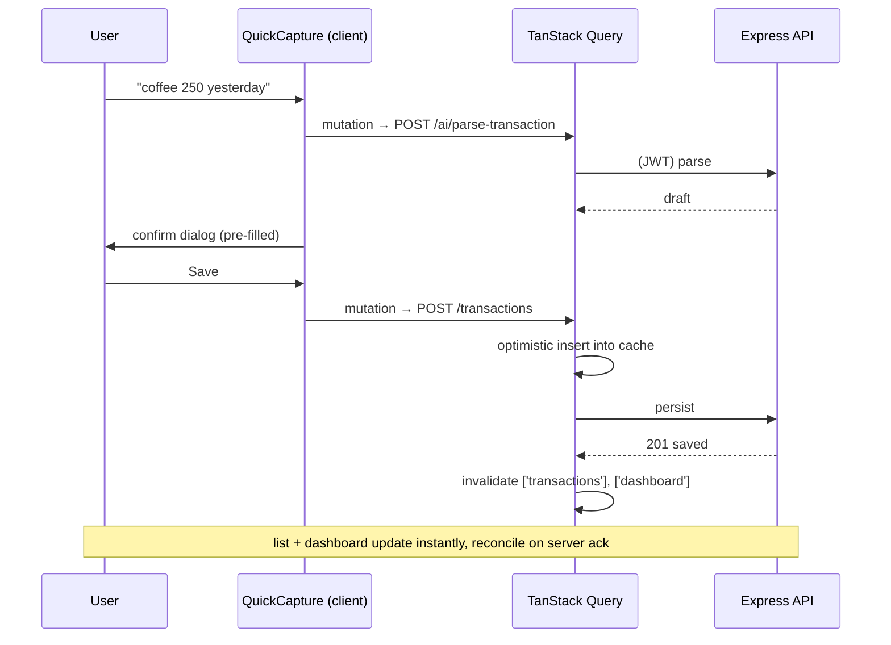

# Chapter 8 — Frontend Architecture

> Status: **Draft for review** · Depends on: Ch 4 (screens), Ch 6 (contract), Ch 7 (API)
> Links forward: Ch 10 (token storage), Ch 11 (design system)

This opens the "Next.js client" box. The goal: a UI that is **fast**, **type-safe
against the API**, and organized so a reviewer can find any piece by its role.

> **Mentor lens:** the central frontend problem is **state** — specifically, keeping
> the screen in sync with server data that other actions keep changing. Most
> frontend bugs (stale lists, double submits, spinners that never stop) are state
> bugs. So the biggest decision in this chapter is *how we manage server state* — and
> we solve it with a tool built for exactly that, rather than hand-rolling `useEffect`
> + `useState` everywhere.

---

## 8.1 Rendering strategy — server vs. client components

Next.js App Router gives us both. We split by *zone* (Ch 4):

| Zone | Components | Why |
|------|-----------|-----|
| **Public** (`/`, `/login`, `/signup`) | **Server Components** | Fast first paint, SEO for the landing page, no interactivity needed |
| **App** (`/app/*`) | **Client Components** + data hooks | Behind auth, highly interactive, per-user data |

> **Why the app is client-rendered (a real, defensible call):** our auth is a
> JWT held by the browser (Ch 6/10). React Server Components run on the *server* and
> can't see a browser-held token, so authenticated data is fetched **client-side**.
> We *could* make Next a BFF that proxies to Express with cookie tokens and use Server
> Components everywhere — cleaner in theory, but it adds a whole proxy layer and
> couples us tighter to Next. For a portfolio that showcases **React data-fetching
> skill** (TanStack Query, caching, optimistic updates), client-side fetching is both
> simpler *and* the more marketable skill. **Trade-off named:** we give up some SSR
> benefits inside the app (irrelevant behind a login) to gain simplicity and a strong
> client-data story. This is the frontend counterpart to Ch 6.3's service-split
> decision — a conscious pick, not a default.

---

## 8.2 State: three kinds, three tools

The senior move is recognizing **"state" is not one thing**:

| Kind of state | Example | Tool | Why |
|---------------|---------|------|-----|
| **Server state** | transactions, budgets, dashboard | **TanStack Query** | caching, dedup, background refetch, invalidation — built for remote data |
| **Global UI state** | Quick-Capture open, theme, base-currency display | **React Context** (small) | tiny, rarely changes; no library needed |
| **Local/form state** | the add-transaction form | **react-hook-form + zod** | reuses the *same* zod schemas as the API (Ch 7) |

> **Why TanStack Query instead of `useEffect` + `useState`:** hand-rolled fetching
> re-implements caching, loading/error flags, refetch, dedup, and cache invalidation
> — badly — in every component. Query gives all of that declaratively and makes the
> hardest part (keeping the UI fresh after a mutation) a one-line
> `invalidateQueries`. This is the single highest-leverage frontend decision in the
> chapter, and "I use React Query properly" is a concrete hireable skill.
>
> **Why NOT Redux:** our server state lives in Query; our client state is tiny. Redux
> would be ceremony without payoff. Knowing when *not* to reach for the heavy tool is
> senior judgment. (If global client state grew, Zustand — not Redux — would be the
> lightweight next step.)

---

## 8.3 Folder structure (`/web`)

```
web/
├─ app/
│  ├─ (marketing)/            # route group → server components
│  │  ├─ page.tsx             # landing
│  │  ├─ login/page.tsx
│  │  └─ signup/page.tsx
│  ├─ (app)/                  # route group → auth-guarded shell
│  │  ├─ layout.tsx           # sidebar + top bar + <QuickCapture/>
│  │  ├─ page.tsx             # dashboard  (/app)
│  │  ├─ transactions/{page,import/page}.tsx
│  │  ├─ accounts/page.tsx
│  │  ├─ budgets/page.tsx
│  │  └─ settings/page.tsx
│  └─ layout.tsx              # root: providers (Query, Theme, Auth)
├─ components/
│  ├─ ui/                     # design-system primitives (Ch 11): Button, Input, Card…
│  ├─ patterns/               # composites: DataTable, StatCard, EmptyState, Money
│  └─ features/               # feature-bound: TransactionForm, BudgetBar, QuickCapture
├─ hooks/                     # useTransactions, useBudgets, useDashboard (Query hooks)
├─ lib/
│  ├─ api-client.ts           # typed fetch wrapper (adds JWT, parses envelope)
│  ├─ money.ts                # minor-units ↔ display (mirror of api/lib/money)
│  └─ query-client.ts
└─ providers/                 # QueryProvider, ThemeProvider, AuthProvider
```

> **Design decision — three component tiers** (`ui` → `patterns` → `features`) mirror
> the backend's layering: primitives know nothing about finance; features know
> nothing about how a Button is styled. A reviewer instantly knows where new code
> belongs, and the design system (Ch 11) can evolve without touching feature logic.

---

## 8.4 The typed API client — where "the API is the contract" pays off

`lib/api-client.ts` is a thin fetch wrapper that: attaches the JWT, unwraps the
`{ data }` / `{ error }` envelope (Ch 7.5), throws typed errors, and — crucially —
returns types imported from `packages/types`.

```
// hook, illustrative
useTransactions(filters)  ->  useQuery<Transaction[]>(...)   // Transaction from packages/types
```

> **The payoff:** if the backend changes a response shape, `packages/types` changes,
> and the **frontend fails to compile** until it's updated. That's a free,
> compile-time integration test across the service boundary — the concrete reward for
> the monorepo + shared-types decision (Ch 6.10).

---

## 8.5 Data flow — the wedge (A1) with optimistic UX



> **Debugger lens — optimistic updates are powerful and dangerous.** Inserting into
> the cache *before* the server confirms makes the UI feel instant, but if the request
> fails we must **roll back** to avoid showing a transaction that didn't save.
> TanStack Query's `onError` rollback handles this — but forgetting it is a classic
> bug: a "saved" item that vanishes on refresh. We adopt optimistic UX *with* explicit
> rollback, or not at all.

---

## 8.6 Four states, everywhere (enforced by the tools)

Ch 4 mandated every screen own empty/loading/error/offline. TanStack Query makes this
structural: each hook exposes `isLoading / isError / data`, so a screen *must* handle
them. A shared `<QueryBoundary>` pattern renders skeleton → error → empty → content
consistently.

> **Mentor lens:** the framework choice *enforces* the discipline. Because a Query
> hook hands you `isLoading`/`isError`, ignoring them is a visible omission in review,
> not an invisible gap. Good architecture makes the right thing the easy thing.

---

## 8.7 Styling & design-system hook-in (full detail Ch 11)

- **Tailwind CSS** for utility styling + a small set of **design tokens** (color,
  spacing, radius, typography) as CSS variables → theming + dark mode.
- **`components/ui/`** are the only place raw Tailwind lives for primitives; features
  compose primitives, not utilities. Keeps the look consistent and swappable.
- Headless primitives (e.g. Radix) for accessible dialogs/menus (Quick Capture uses a
  command-dialog). Rationale and full system in Ch 11.

---

## 8.8 PR-reviewer walkthrough (practice)

Reviewing a `TransactionsPage` PR:

- ✅ **Good:** data via a `useTransactions` Query hook (not `useEffect`); loading/error/empty handled; money rendered through `lib/money`; types from `packages/types`; form validated with the shared zod schema.
- 🔶 **Request changes if:** a mutation lacks `invalidateQueries` (stale list), an optimistic update lacks rollback, a `key` prop is an array index, or business logic (e.g. transfer rules) leaked into the component.
- ❌ **Block if:** fetch calls scattered in components bypassing the api-client, money math on floats in the UI, or a secret referenced as `NEXT_PUBLIC_*`.

---

## 8.9 End-of-chapter checkpoint

### ✅ Decisions locked
- **Public zone = Server Components; App zone = Client Components** + data hooks.
- **State split into three:** server (**TanStack Query**), global UI (**Context**), forms (**react-hook-form + zod**, schemas shared with the API).
- **No Redux** (deliberate); Zustand named as the escape hatch if client state grows.
- **Three component tiers:** `ui` → `patterns` → `features`.
- **Typed api-client** returning `packages/types` → compile-time cross-service contract check.
- **Optimistic UX with mandatory rollback**; **four states enforced** via Query.
- **Tailwind + design tokens** (system detailed in Ch 11).

### ❓ Open questions (for you)
1. **Token storage (links to Ch 10)** — access token **in memory** + refresh token in an **httpOnly cookie** (more secure, slightly more wiring) vs. tokens in `localStorage` (simplest, XSS-exposed)? *(Recommend: in-memory access + httpOnly refresh — we'll design it fully in Ch 10.)*
2. **Component library base** — hand-built primitives on Radix + Tailwind (most skill shown, more work) vs. shadcn/ui (fast, polished, still "your" code) vs. a prebuilt kit like MUI (fastest, less custom)? *(Recommend: shadcn/ui — copy-in components you own and can customize; best effort-to-polish ratio and very current.)*
3. **Charts** on the dashboard — Recharts (simple, React-native feel) vs. visx/D3 (more custom, more effort)? *(Recommend: Recharts for v1.)*

### ⚠️ Risks
- **R1 — Stale cache after mutations:** the most common Query bug. Mitigation: a convention that every mutation declares its `invalidateQueries`; check it in review (§8.8).
- **R2 — Optimistic update without rollback:** ghost data. Mitigation: a shared mutation helper that pairs optimistic apply + rollback.
- **R3 — Client/server type drift:** if someone edits a response inline instead of `packages/types`, the compile-time check is bypassed. Mitigation: forbid inline API response types; always import from the shared package.

### 💡 CTO recommendations
- Build **`api-client.ts`, `money.ts`, and the Query hooks first** — they're the spine every screen hangs off; scaffolding them early prevents ad-hoc `fetch` sprawl.
- Adopt **shadcn/ui** so you own the component code (customizable, portfolio-credible) without hand-building every primitive — velocity *and* skill signal.
- Treat **`invalidateQueries` as part of the definition-of-done for any mutation** — it's the difference between a UI that feels alive and one that feels broken.

---

**Next chapter on your approval → Chapter 9: AI Architecture** — the flagship. The A1
pipeline in depth: prompt design, the structured-output contract, model choice &
token/cost budget, demo-mode caching, guardrails, and failure handling. (I'll consult
the current Claude API reference for accurate model/pricing details.)
