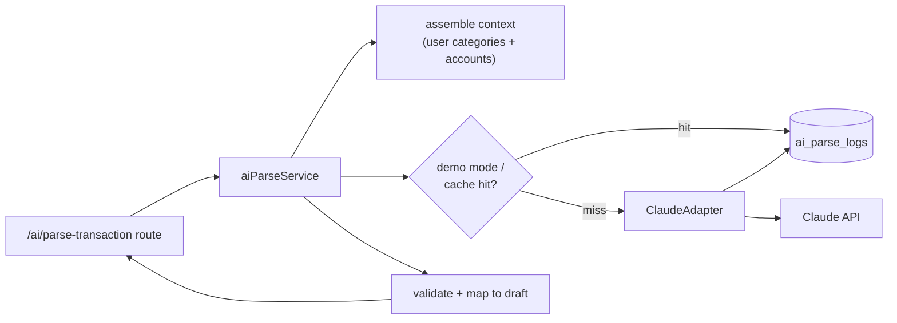

# Chapter 9 — AI Architecture (the flagship)

> Status: **Draft for review** · Depends on: Ch 3 (A1 spec), Ch 5 (`ai_parse_logs`), Ch 6 (AI provider, demo mode), Ch 7 (adapter layer)
> Model/pricing facts verified against the current Claude API reference (cached 2026-06-24).

This is the chapter that earns the product its name. Everything else is a competent
finance app; **this** is what makes it "AI-first." We design the flagship feature —
**natural-language transaction capture (A1)** — as a robust, cheap, safe pipeline,
and establish the *pattern* every later AI feature reuses.

> **Mentor lens — the senior AI-engineering mindset:** an LLM is a **non-deterministic
> function that can fail or be wrong**. Junior AI code calls the model and trusts the
> output. Senior AI code wraps the model in a contract (structured output), a safety
> net (confirm-before-save), a fallback (manual form), and a budget (token caps + demo
> cache). We're not "adding AI" — we're *engineering around* an unreliable-but-powerful
> component. That framing is the whole chapter.

---

## 9.1 Where AI lives in the architecture

The AI provider is reached **only** through an **adapter** behind the service layer
(Ch 7). Nothing else in the codebase knows Claude exists.



> **Design decision — one adapter, one seam.** The `ClaudeAdapter` is the *only* file
> that imports the Anthropic SDK and holds the API key. *Why:* (1) the provider is
> swappable without touching business logic, (2) the secret lives in exactly one place
> (Ch 6/12), (3) every AI feature (Phase 2 chat, health score) goes through the same
> seam, so cost controls, logging, and error handling are solved once. This is the
> repository-pattern idea (Ch 7) applied to an external model.

---

## 9.2 The A1 pipeline, end to end

`"lunch 320 yesterday with card"` → a confirmed transaction.

1. **Assemble context** — load the user's categories (`kind='expense'`) and accounts
   (id + name + currency). This grounds the model so it maps to *real* categories, not
   invented ones.
2. **Call the model with a structured-output contract** (§9.4) — the response is
   *guaranteed* to be valid JSON matching our schema, or the call errors.
3. **Validate & map** — verify the returned `categoryId`/`accountId` actually belong to
   this user (never trust the model with authorization), coerce the amount to
   integer minor units (Ch 5 D1), resolve the date.
4. **Return a draft** — never persist. The UI shows a pre-filled confirm dialog (Ch 4).
5. **On confirm** — a *separate* `POST /transactions` call with `source='ai'` persists it.
6. **Log** — write input + parsed output + tokens + accepted-flag to `ai_parse_logs`.

> **Mentor lens — steps 3 and 4 are the senior moves.** Step 3: the model returns a
> `categoryId`, but we *re-check it against the user's own rows* — a hallucinated or
> cross-user ID is rejected here, so a wrong model can never write bad or foreign data.
> Step 4: parse and persist are **different operations**; the AI only ever proposes.
> This is the difference between "impressive demo" and "corrupts my ledger."

---

## 9.3 Model choice & cost — the honest engineering

**Recommendation: `claude-haiku-4-5` for A1.**

| Model | Input $/1M | Output $/1M | Fit for A1 |
|-------|-----------|-------------|-----------|
| **Claude Haiku 4.5** | **$1.00** | **$5.00** | ✅ Best — simple structured extraction, fast, cheapest |
| Claude Sonnet 5 | $3.00 ($2 intro) | $15.00 ($10 intro) | Upgrade path if parse accuracy on messy input disappoints |
| Claude Opus 4.8 | $5.00 | $25.00 | Overkill for extraction; save for reasoning-heavy Phase-2 chat |

> **Why Haiku, not the flagship model:** A1 is a *bounded extraction* task — turn one
> sentence into ~6 fields against a known list. That is precisely what the smallest,
> fastest model is for. Reaching for Opus here would be paying 5× for reasoning the
> task doesn't need — the AI-engineering equivalent of over-provisioning. We keep Sonnet
> 5 as a documented upgrade lever if real-world parses prove unreliable, and reserve
> Opus for Phase 2's AI CFO chat, where multi-step reasoning over the whole ledger
> actually justifies it. **Matching model tier to task difficulty is a senior cost
> instinct.**

**Per-call cost math** (a parse ≈ 500 input + 120 output tokens on Haiku):
`500 × $1/1M + 120 × $5/1M ≈ $0.0011` — about **one-tenth of a cent per capture**.
Even 5,000 recruiter interactions ≈ **$5.50 total**, and demo mode (§9.6) drives the
*live-demo* cost to **$0**.

> **Token discipline:** we count tokens with the API's `count_tokens` endpoint, never a
> client-side estimator (they mis-count for Claude). A hard `max_tokens` cap on the
> output plus a light rate limit on `/ai/*` (Ch 7) bound the worst case.

---

## 9.4 The structured-output contract

We use Claude's **structured outputs** (`output_config.format` with a JSON schema),
supported on Haiku 4.5. This *guarantees* the response is valid JSON in our shape —
no brittle string-parsing of model prose.

```jsonc
// The parsed-transaction schema (the contract the model must satisfy)
{
  "type": "expense" | "income",
  "amount": number,            // major units, e.g. 320.00 — we convert to minor
  "currency": string | null,   // ISO code; null → default to the account/user currency
  "categoryId": string | null, // MUST be one of the user's category ids, or null
  "accountId": string | null,  // MUST be one of the user's account ids, or null
  "occurredAt": string,        // ISO date; model resolves "yesterday" → a date
  "note": string | null,
  "confidence": number         // 0–1, model's self-rated parse confidence
}
```

> **Mentor lens — the schema *is* the contract.** By constraining the output to this
> shape, we move an entire class of bugs (malformed JSON, missing fields, prose
> wrapping) from *runtime* to *impossible*. `confidence` lets the UI decide: high →
> pre-filled draft; low → open the manual form pre-filled as best-effort (the Ch 4
> failure branch). We let the model *rate itself*, then *we* decide what to do with it.

**Prompt design (kept in `ai/prompts/parse-transaction.ts`, versioned):**
a stable system prompt (the rules + today's date passed as data, not interpolated into
a cached prefix) + the user's category/account context + 2–3 few-shot examples + the
user's sentence. Prompt text is a reviewed artifact, not a magic string buried in code.

---

## 9.5 Demo mode — $0 for recruiters (the clever bit)

The `ai_parse_logs` table (Ch 5) doubles as a cache. When `DEMO_MODE=true` (or on a
cache hit for an identical normalized input), the service returns the stored
`parsed_json` and **skips the API call entirely**.

- A curated seed of demo inputs (`"coffee 250 yesterday"`, `"salary 50000"`, …) is
  pre-populated so the flagship feature *always* works instantly and for free in the
  live portfolio demo.
- Real users (if any) hit the live model; their results are logged, warming the cache.

> **CTO note:** this is a *product* decision disguised as a cache. A recruiter clicking
> the hero feature must never see a spinner, a bill, or a bad parse. Demo mode
> guarantees a fast, correct, $0 "wow" — while the same code path runs live for real
> input. One branch, two behaviors (Ch 6.6).

---

## 9.6 Guardrails & safety model

| Guardrail | Protects against | Mechanism |
|-----------|------------------|-----------|
| **API key server-side only** | Key theft / abuse (Ch 6, 12) | Key lives in `ClaudeAdapter` env; never in the client bundle |
| **Confirm-before-save** | Wrong parse corrupting data | AI returns a draft; user confirms; separate persist call |
| **Re-authorize IDs** | Cross-user / hallucinated refs | Validate `categoryId`/`accountId` against this user's rows |
| **Structured output** | Malformed/unparseable responses | `output_config.format` guarantees the shape |
| **Token cap + rate limit** | Cost runaway / abuse loops | `max_tokens` + limiter on `/ai/*` (Ch 7) |
| **Deterministic fallback** | Model down / low confidence | Route to the pre-filled manual form (Ch 4 Flow 2) |
| **Input length cap** | Prompt-injection / oversized input | Reject > N chars before the call; treat input as data, not instructions |

> **Debugger lens — the failure modes, and how each is *handled*, not feared:**
> - *Misparsed amount / wrong category* → confirm step turns it into a one-tap edit.
> - *Ambiguous date ("last Friday")* → model resolves to a concrete date shown in the draft; user sees and can fix it.
> - *Hallucinated / foreign `categoryId`* → §9.2 step 3 rejects it → falls to `null` (uncategorized).
> - *Network / API error / rate limit* → adapter throws a typed `AppError`; service catches → returns a "use the form" signal → UI opens the manual form. **The feature never hard-fails.**
> - *Safety refusal* (`stop_reason: "refusal"`) → same fallback path; extremely unlikely for expense text, but handled, not assumed away.
> - *Cost spike* → rate limit + demo mode + a cheap model keep the ceiling at a few dollars.

---

## 9.7 The reusable AI pattern (why Phase 2+ is cheap to add)

Every future AI feature (A3 CFO chat, A5 health score, A8 monthly report) follows the
**same four-part shape** established here:

1. **Adapter call** through `ClaudeAdapter` (one seam, one key, one place for cost/log).
2. **Grounding context** assembled from the user's own data (never the model's memory).
3. **Structured contract** where the output must be machine-usable (health score,
   extracted fields); free-form where it's a narrative (chat, report).
4. **Guardrails** — validate, log to an `ai_*_logs` table, cap tokens, handle failure.

> **CTO note — this is the payoff of architecting the flagship carefully.** Because A1
> forced us to build the adapter, the logging table, the demo-cache, and the
> guardrail discipline, Phase 2 features *inherit* all of it. The flagship isn't just a
> feature — it's the **template** for the AI layer. That's why "AI-first" is an
> architecture decision, not a marketing word.

---

## 9.8 End-of-chapter checkpoint

### ✅ Decisions locked
- AI reached only via a single **`ClaudeAdapter`** seam (key + cost + logging centralized).
- A1 pipeline: **context → structured-output call → validate/re-authorize → draft → confirm → persist → log.**
- Model: **`claude-haiku-4-5`** for A1 (≈ $0.001/call); Sonnet 5 as the accuracy upgrade lever; Opus reserved for Phase-2 reasoning.
- **Structured outputs** (`output_config.format`) as the response contract, with a `confidence` field driving UI behavior.
- **Demo mode** via `ai_parse_logs` → $0 live demo; same code path serves live input.
- Seven guardrails; **every failure mode routes to the manual-form fallback** — the feature cannot hard-fail.
- The four-part AI pattern is the reusable template for all Phase 2+ AI features.

### ❓ Open questions (for you)
1. **Voice-to-text on A1** — confirmed Phase 4 (Ch 1). Still text-only for v1? *(rec: yes.)*
2. **Confidence threshold** — what `confidence` cutoff flips from "pre-filled draft" to "open the manual form"? *(rec: start at 0.6, tune against `ai_parse_logs` acceptance data.)*
3. **Provider abstraction depth** — keep the adapter Claude-specific (simplest) or design a generic `LLMProvider` interface now for "swap-ability" theater? *(rec: Claude-specific adapter with a clean method signature; a generic interface is premature — YAGNI — but the seam already makes swapping easy.)*

### ⚠️ Risks
- **R1 — Over-trusting the model:** any code path that persists AI output without the confirm step or ID re-check reintroduces the corruption risk. Mitigation: persistence is a *separate* endpoint; AI service returns drafts only.
- **R2 — Cost surprise from a loop/bug:** a retry storm on `/ai/*` could rack up calls. Mitigation: rate limit + `max_tokens` + demo mode; monitor `ai_parse_logs` volume.
- **R3 — Demo mode masking real breakage:** if we only ever test in demo mode, a broken live path ships unnoticed. Mitigation: a test that exercises the *live* adapter path (mocked API) explicitly (Ch 13).

### 💡 CTO recommendations
- Build the **`ClaudeAdapter` + `ai_parse_logs` write + demo-cache read** as the first AI code, before the prompt is even tuned — the plumbing is what makes the feature safe and cheap.
- Treat the **prompt as reviewed source** (versioned file, few-shot examples, a tiny eval set of sentences → expected fields) — this is how you improve parse quality methodically instead of by vibes.
- Keep `confidence` and `accepted` in `ai_parse_logs` from day one — they're your only real signal for whether the wedge actually works.

---

**Next chapter on your approval → Chapter 10: Authentication Flow & Authorization
Model** — JWT issuance, the in-memory-access + httpOnly-refresh scheme we locked in
Ch 8, the middleware that turns a token into `req.userId`, and how the `user_id`
data-scoping rule (Ch 5 D3) becomes the whole authorization model.
