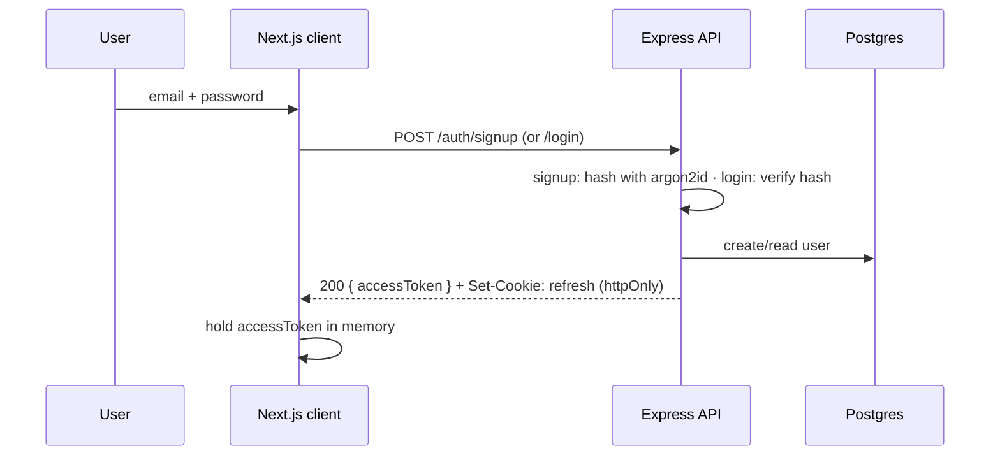
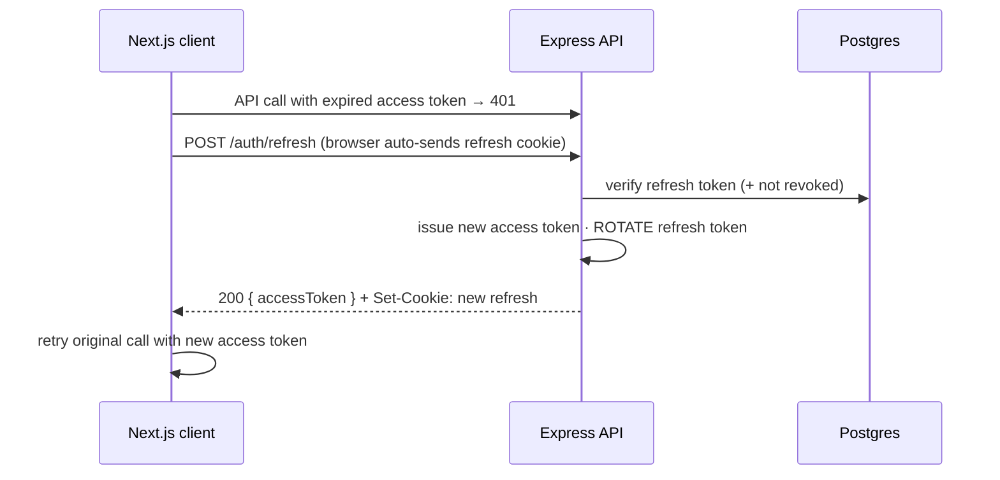

# Chapter 10 — Authentication Flow & Authorization Model

> Status: **Draft for review** · Depends on: Ch 5 (`users`, D3), Ch 6 (stateless JWT), Ch 7 (middleware pipeline), Ch 8 (token storage)
> Locked upstream: in-memory access token + httpOnly refresh cookie.

Auth is where a bug is a *breach*, not an inconvenience. This chapter defines two
separate things people often conflate:

- **Authentication** — *who are you?* (login, tokens, sessions)
- **Authorization** — *what are you allowed to touch?* (per-user data scoping)

> **Mentor lens:** most "auth" tutorials stop at login. The harder, more important half
> is authorization — and our answer is refreshingly small because we designed for it in
> Ch 5: **every owned row has `user_id`, every query is scoped by it.** Watch how a
> whole security model collapses into one rule when the data layer is right.

---

## 10.1 Authentication — the token scheme

We issue **two JWTs** on login:

| Token | Lifetime | Stored where | Purpose |
|-------|----------|--------------|---------|
| **Access token** | short (~15 min) | **in memory** (JS variable/React state) | Sent as `Authorization: Bearer` on every API call |
| **Refresh token** | long (~7 days) | **httpOnly, Secure, SameSite cookie** | Used only to mint a new access token |

> **Why this split (the Ch 8 decision, fully reasoned):** it's a security *tradeoff*,
> and naming the tradeoff is the senior part.
> - Storing tokens in **`localStorage`** is simplest but **XSS-readable** — any injected
>   script steals them. Rejected.
> - An **httpOnly cookie** can't be read by JS (XSS-safe) but is **auto-sent by the
>   browser**, which opens **CSRF**. So we put only the *refresh* token there, guard it
>   with `SameSite`, and keep the *access* token in memory (gone on refresh, never in a
>   cookie, not CSRF-able).
> - Net: an attacker needs *both* an XSS hole (to grab the in-memory access token,
>   which dies in 15 min) *and* a CSRF bypass (for the refresh cookie). We don't
>   eliminate risk — we make the two easy attacks each insufficient alone.

---

## 10.2 The flows

### Signup / Login



- **Passwords** are hashed with **argon2id** (memory-hard, modern) — or bcrypt as the
  well-understood fallback. We **never** store or log plaintext; the salt is built into
  the hash. Comparison is constant-time (the library handles it).

### Refresh (silent re-auth)



> **Design decision — rotate the refresh token on every use.** Each refresh issues a
> *new* refresh token and invalidates the old one. *Why:* if a refresh token is ever
> stolen and used, the legitimate user's next refresh (or the thief's) creates a
> mismatch we can detect and kill the session. Rotation turns a stolen long-lived token
> from a permanent backdoor into a short race.

### Logout

Clear the refresh cookie **and** revoke it server-side (below).

---

## 10.3 Stateless vs. revocable — the one real design tension

A pure-JWT system is **stateless**: the server trusts any correctly-signed token until
it expires. That's why it scales (Ch 6) — but it means you **can't log someone out**
before expiry, because there's nothing to invalidate.

**Our resolution:** keep *access* tokens fully stateless (short-lived, never stored),
but make *refresh* tokens **revocable** by storing a reference server-side.

| Option | Revocable? | Cost | Pick |
|--------|-----------|------|------|
| Pure stateless (no store) | ❌ can't logout/revoke | none | — |
| **`token_version` int on `users`** | ✅ (bumps invalidate all refresh tokens) | trivial | ✅ **v1** |
| Refresh-token table (hashed, per-device) | ✅ per-device revoke | a table + writes | later, if multi-device matters |

> **Mentor lens:** this is the classic JWT tradeoff, and the answer isn't "stateless
> good, stateful bad" — it's *which* token gets which property. Short stateless access
> tokens give scale; a tiny revocation handle on refresh gives control. A `token_version`
> column (bumped on logout / password-change) invalidates every outstanding refresh
> token for that user with **one integer** — cheapest possible revocation.

---

## 10.4 The middleware — token → `req.userId`

The auth middleware (Ch 7 pipeline) is small and runs on every protected route:

```
1. read Authorization: Bearer <access token>
2. verify signature + expiry with the JWT secret
3. valid   → attach req.userId = payload.sub ; next()
   invalid → 401 (client triggers the refresh flow)
```

Everything downstream — services, repositories — trusts that single `req.userId`. It's
the *only* identity value in the system.

> **Debugger/security lens:** the failure to avoid is **trusting a client-supplied user
> id** (a `userId` in the body/query) instead of the verified token's `sub`. If any
> endpoint reads "whose data" from anywhere but `req.userId`, that's an
> account-takeover bug. Rule: **identity comes from the token, never the request body.**

---

## 10.5 Authorization — the whole model is one rule

We have **one user type** in v1. There is no RBAC, no permissions matrix. Authorization
is **ownership-based**:

> **Every data access is scoped by `req.userId`, enforced in the repository layer (Ch 5
> D3, Ch 7).** You can only read/write rows where `user_id = req.userId`. Full stop.

That single rule covers every screen and endpoint. A request for
`GET /transactions/:id` that belongs to another user returns **404** (not 403 — we
don't even confirm the row exists), because the repository query
`WHERE id = ? AND user_id = ?` simply finds nothing.

> **Mentor lens — why this is *better* than a permissions system here:** a permissions
> matrix is code you can get wrong. "Scope every query by owner" is a single invariant
> enforced in *one* layer, impossible to forget if the repository injects it (Ch 7 §7.1).
> Complexity you don't add is complexity that can't have a bug. The senior instinct is
> to reach for the *smallest* model that satisfies the requirement.

**Extensibility (where roles would slot in):** if later phases add shared accounts
(family finance) or an admin view, we'd introduce a `roles`/`memberships` table and a
second check *alongside* ownership — never replacing it. The `user_id` scope stays as
the floor; roles layer on top. We're architected for it without paying for it now.

---

## 10.6 Auth implementation choice

**Recommendation: self-rolled JWT auth in the Express API** (using `jsonwebtoken` +
`argon2`), *not* Auth.js.

> **Why, for *this* architecture and your goals:**
> - **Auth.js (NextAuth)** is designed to live *inside* Next.js. We deliberately put
>   auth in the **separate Express API** (Ch 6), where Auth.js fits awkwardly. Forcing
>   it in would fight the architecture.
> - **Self-rolled JWT** matches the service boundary cleanly, and — per your learning
>   goals — auth is one of the highest-value things to understand *from the
>   fundamentals*: hashing, token lifecycle, refresh rotation, middleware. Building it
>   teaches exactly the senior knowledge you want.
> - **The honest tradeoff:** rolling your own means *you* own the security surface
>   (rotation, revocation, secure cookie flags) — more to get right. For a real
>   money-handling company I'd push toward a managed provider (Clerk/Auth0) to offload
>   that risk. For a portfolio piece where *demonstrating you understand auth* is the
>   point, and there's no real PII (Ch 0), self-rolled is the right call. Marking this
>   as an open question so you decide with the tradeoff in view.

---

## 10.7 End-of-chapter checkpoint

### ✅ Decisions locked
- **Two JWTs:** short in-memory access + long httpOnly-cookie refresh (XSS/CSRF tradeoff reasoned).
- **argon2id** password hashing; never store/log plaintext.
- **Refresh rotation** on every use; **`token_version` on `users`** for cheap revocation/logout.
- **Access tokens stateless** (scale) + **refresh revocable** (control) — the tension resolved per-token.
- Middleware maps a verified token → **`req.userId`**, the system's only identity value.
- **Authorization = ownership scoping by `user_id`** in the repository; no RBAC in v1; roles are a future layer *on top*.
- **Cross-user access returns 404**, not 403.

### ❓ Open questions (for you)
1. **Auth implementation** — self-rolled JWT (learning + fits Express; you own the security surface) vs. a managed provider like Clerk (less to get wrong, has a free tier)? *(Recommend: self-rolled JWT for the learning value and architectural fit — but it's a real tradeoff.)*
2. **Access token lifetime** — 15 min (more refreshes, tighter blast radius) vs. 60 min (fewer refreshes, simpler)? *(Recommend: 15 min.)*
3. **CSRF hardening for `/auth/refresh`** — rely on `SameSite=strict` alone (simple, fine for a same-site demo) or add a double-submit CSRF token (belt-and-suspenders)? *(Recommend: `SameSite=strict` for v1; document the CSRF-token upgrade in Ch 12.)*

### ⚠️ Risks
- **R1 — Trusting a client-supplied user id:** the #1 authz bug. Mitigation: identity *only* from `req.userId`; lint/review for any `userId` read from body/query in a handler.
- **R2 — JWT secret leakage / weakness:** a leaked or weak signing secret forges any identity. Mitigation: strong secret in server-only env (Ch 6/12); rotate on suspicion (bumps invalidate via re-sign).
- **R3 — Login abuse (brute force / user enumeration):** Mitigation: rate-limit `/auth/*`; return a *generic* "invalid credentials" (never "no such user"); constant-time hash compare.

### 💡 CTO recommendations
- Enforce **"identity from token, scope from repository"** as an unbreakable rule — together they *are* the security model; everything else is a refinement.
- Build **refresh rotation + `token_version` revocation** in v1 even though it's a little extra — "I can actually log a user out" is a credibility signal in a finance app, and it's cheap.
- Keep the **auth code in its own `modules/auth`** with its own tests (Ch 13) — it's the highest-risk module and deserves the most direct verification.

---

**Next chapter on your approval → Chapter 11: Design System, UI Components &
Wireframes** — the visual language (tokens, dark mode, the shadcn/ui component tiers
from Ch 8), the seed/demo dataset + default category list (deferred here from Ch 5),
and wireframes for the hero screens: dashboard, transactions, and the Quick-Capture
overlay.
