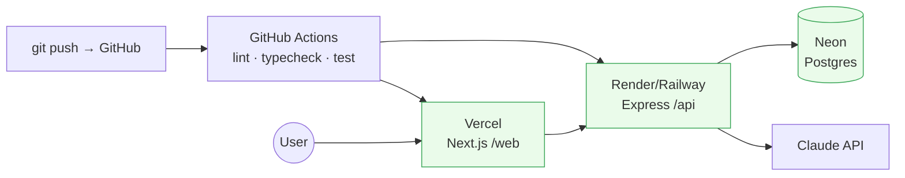

# Chapter 14 — Deployment & Scaling Strategy

> Status: **Draft for review** · Depends on: Ch 6 (topology, stateless API, async seam), Ch 12 (secrets), Ch 13 (CI)
> Locked upstream: monorepo · manual warm-up for v1 · ~$0/month.

Two jobs here: (1) get the app **live on a public URL at $0**, and (2) tell an **honest
scaling story** — what breaks first as load grows and the cheap next step for each.
The second is where the senior thinking shows.

> **Mentor lens:** deployment is where architecture meets reality. The design choices
> we made for *scalability* (stateless API, `user_id`-scoped queries, an async seam)
> pay off here as a *credible growth path* — not because we'll have millions of users,
> but because we can **articulate exactly how it would scale**. Knowing your next
> bottleneck before you hit it is the skill.

---

## 14.1 Deployment topology (free tiers)

| Component | Host | Free tier | Notes |
|-----------|------|-----------|-------|
| Next.js `/web` | **Vercel** | Hobby | instant deploys + instant rollback; global CDN |
| Express `/api` | **Render** (or Railway/Fly) | Free (~750 hrs/mo) | sleeps on idle — see §14.4 |
| Postgres | **Neon** | Free (~0.5 GB, autosuspend) | branch DBs for test (Ch 13) |
| AI | Claude API | pay-per-call | negligible + demo mode (Ch 9) |

**Total: ~$0/month** at showcase scale.

---

## 14.2 Monorepo deploy config

One repo (Ch 6), three deploy targets:

- **Vercel** → root directory `web/`, builds the Next app; auto-deploys on push to `main`.
- **Render** → root directory `api/`, build + start the Express server; auto-deploys on push.
- **`packages/types`** → a workspace dependency both build steps resolve; the shared
  contract ships to both sides (Ch 6/8).

> **Design decision — auto-deploy from `main`, PRs gated by CI.** Merge to `main` → both
> hosts rebuild. The CI gate (Ch 13) is what makes this safe: nothing merges red. This
> is lightweight CD without a pipeline to babysit — right-sized for solo.

---

## 14.3 Config, secrets & migrations

- **12-factor config:** every environment-specific value is an **env var**, set in each
  platform's dashboard — not in code (Ch 12). `.env.example` documents the required
  keys; real `.env` is gitignored.
- **Secrets** (JWT secret, DB URL, Claude key) live only on the **API host** (Render).
  The client gets only public values (`NEXT_PUBLIC_API_URL`).
- **Migrations:** `prisma migrate deploy` runs as a **release step** before the new API
  version serves traffic — schema is versioned, forward-only, reviewable (Ch 5/7).
- **Seed:** the demo dataset (Ch 11) is a one-shot `seed` script against the prod DB so
  the live demo is populated from first load.

> **Mentor lens — why config-as-env, not config-in-code:** the same build artifact runs
> in local, CI, and prod, differing only by injected env. No "if prod then…" branches,
> no secret ever compiled into the bundle. This is the 12-factor discipline that makes
> deploys boring — and boring deploys are good deploys.

---

## 14.4 Cold starts — the free-tier reality

Render's free tier **sleeps after ~15 min idle**; the next request pays a ~30s cold
start. For a live demo, a 30-second spin-up reads as "broken."

**v1 decision (locked): manual warm-up.** Hit the API's `/health` endpoint a minute
before demoing; it's awake for the session. Demo mode (Ch 9) keeps the AI feature
*instant* regardless.

> **Deferred, not forgotten:** a tiny cron ping every ~10 min keeps it always warm — but
> that burns the free monthly instance-hours (~750 hrs ≈ one always-on service, so it
> *fits*, but don't run a second always-on service on the same free account). We start
> manual (zero cost/complexity) and add the cron only if cold starts actually bite. This
> is the YAGNI call from Ch 6, carried through.

---

## 14.5 Observability (lightweight)

- **Logs:** platform log streams (Vercel/Render) + our structured logger with a
  `request-id` per request (Ch 7) — enough to trace a failure.
- **Health check:** `GET /health` (also the warm-up target).
- **Errors (optional):** Sentry free tier for the API if you want real error tracking —
  a nice portfolio touch, not required for v1.

> **Right-sizing:** full observability (metrics, tracing, dashboards) is overkill at this
> scale. Logs + a health check + optional error tracking is the honest amount. Adding
> Datadog to a portfolio app is cargo-culting, not engineering.

---

## 14.6 The scaling story (the honest, senior part)

We are **not** built for millions of users — we're **designed so it could scale**, and
here's the *bottleneck-ordered* proof. For each: what breaks first, and the cheap next step.

| # | Grows to | First bottleneck | Cheap next step |
|---|----------|------------------|-----------------|
| 1 | steady demo traffic | free-tier **cold starts** | keep-warm cron / cheapest paid tier (§14.4) |
| 2 | ~hundreds of users | **DB connection limits** (serverless + Prisma) | Neon's **pooler / PgBouncer**; bump tier |
| 3 | more API load | single Express instance CPU | **stateless API scales horizontally** — add instances behind a balancer (JWT is stateless, so *no* session store to share — Ch 6/10 pays off) |
| 4 | data-dense dashboards | **aggregate query** latency | indexes already in place (Ch 5); then cached/materialized summaries; then a read replica |
| 5 | AI usage volume | **Claude cost** | cache (demo-mode generalized), cheaper model, batching, tighter rate limits (Ch 9) |
| 6 | Phase 2 features | reports/forecasts blocking requests | the **async seam** (Ch 6.7): move to a queue + background worker — the seam is already there |
| 7 | storage growth | Neon free 0.5 GB | paid tier; archive/rollup old transactions |

> **Mentor lens — "built to scale" vs "designed so it *could* scale."** Building for
> millions now would be premature optimization (wasted effort, added complexity, YAGNI).
> But *architecting so each bottleneck has a known, cheap unlock* is real senior work —
> and it's demonstrable: notice #3 and #6 cost us *nothing extra now* because the
> stateless-API and async-seam decisions were made in Ch 6. **The scaling story isn't a
> future project; it's the receipt for earlier architecture choices.**

---

## 14.7 Release safety

- **Rollback:** Vercel keeps every deploy (one-click rollback); Render supports redeploy
  of a prior build. A bad ship is a 30-second revert, not an incident.
- **Migration safety:** migrations are **backward-compatible** (add-then-migrate, not
  drop-in-place) so the previous API version keeps working during a rollout — the
  standard expand/contract pattern.
- **CI gate:** nothing reaches `main` red (Ch 13), so "deploy" ≈ "the tests already
  passed."

---

## 14.8 End-of-chapter checkpoint

### ✅ Decisions locked
- **Topology:** Vercel (`/web`) + Render (`/api`) + Neon (Postgres) + Claude API — **~$0/month**.
- **Monorepo**, three deploy targets, **auto-deploy from `main` gated by CI**.
- **12-factor env config**; secrets on the API host only; `prisma migrate deploy` as a release step; seed script for demo data.
- **Manual warm-up** for cold starts in v1 (cron deferred); demo mode keeps AI instant.
- **Lightweight observability:** logs + `/health` + optional Sentry.
- **Bottleneck-ordered scaling story** where #3 (horizontal API) and #6 (async workers) are *free* payoffs of Ch 6 decisions.
- **Rollback + expand/contract migrations** for release safety.

### ❓ Open questions (for you)
1. **API host** — Render (simple, generous free tier, sleeps) vs Fly.io (more control, faster cold starts, fiddlier) vs Railway (nice DX, usage-credit model)? *(Recommend: Render for v1 simplicity; all are free-tier viable.)*
2. **Error tracking** — add Sentry free tier now (portfolio polish + real signal) or defer? *(Recommend: add it — it's a small, credible touch and genuinely useful.)*
3. **Custom domain** — grab a cheap domain for the demo (looks pro) or use the free `*.vercel.app` URL? *(Recommend: a ~₹800/yr domain is worth it for a portfolio link; optional.)*

### ⚠️ Risks
- **R1 — Cold start during a live demo:** reads as broken. Mitigation: manual warm-up ritual; demo mode; cron as the escape hatch.
- **R2 — Migration breaks prod on deploy:** a drop-column mid-rollout. Mitigation: expand/contract, backward-compatible migrations, test the migration on a Neon branch first.
- **R3 — Free-tier limit surprise** (hours/storage/DB connections): Mitigation: know each tier's ceiling (§14.1/14.6); the scaling table is the pre-planned response.

### 💡 CTO recommendations
- Get the **skeleton deployed on day one** — empty app, all three services wired, CI green, a public URL. Deploying early kills the "works on my machine" class of surprises and de-risks the whole build.
- Put the **`/health` + warm-up ritual in the README** so *you* (and a recruiter) always hit a warm, populated demo.
- Keep the **scaling table in the public README** — "here's my next bottleneck and the fix" is one of the strongest senior signals you can show without writing more code.

---

**Next chapter on your approval → Chapter 15: Development Roadmap & Future Roadmap** —
the final chapter: a sprint-by-sprint build order for Phase 1 (core-first, AI-last),
the definition-of-done gate from Ch 3, sequencing that respects dependencies, and the
Phase 2–4 future vision — closing the loop from the Chapter 0 charter to a plan a
developer could execute Monday morning.
